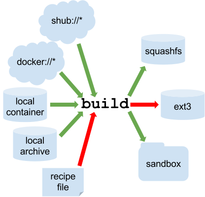

.. figure:: logo.png
   :alt: Singularity
   :width: 40px
   :height: 40px

   Singularity

Getting Started
===============

Quick Start
-----------

This guide is intended for running Singularity on a computer where you
have root (administrative) privileges. If you are learning about
Singularity on a system where you lack root privileges, you can still
complete the steps that do not require the sudo command. If you need to
request an installation on your shared resource, check out our
requesting an installation help page for information to send to your
system administrator.

Installation
~~~~~~~~~~~~

| There are many ways to but this quick start guide will only cover one.

::

    git clone https://github.com/singularityware/singularity.git
    cd singularity
    ./autogen.sh
    ./configure --prefix=/usr/local
    make
    sudo make install

Singularity must be installed as root to function properly.

Overview of the Singularity Interface
~~~~~~~~~~~~~~~~~~~~~~~~~~~~~~~~~~~~~

| Singularity’s allows you to build and interact with containers
  transparently. You can run programs inside a container as if they were
  running on your host system. You can easily redirect IO, use pipes,
  pass arguments, and access files, sockets, and ports on the host
  system from within a container.
| The option gives an overview of Singularity options and subcommands as
  follows:

::

    $ singularity --help
    USAGE: singularity [global options...] <command> [command options...] ...

    GLOBAL OPTIONS:
        -d|--debug    Print debugging information
        -h|--help     Display usage summary
        -s|--silent   Only print errors
        -q|--quiet    Suppress all normal output
           --version  Show application version
        -v|--verbose  Increase verbosity +1
        -x|--sh-debug Print shell wrapper debugging information

    GENERAL COMMANDS:
        help       Show additional help for a command or container                  
        selftest   Run some self tests for singularity install                      

    CONTAINER USAGE COMMANDS:
        exec       Execute a command within container                               
        run        Launch a runscript within container                              
        shell      Run a Bourne shell within container                              
        test       Launch a testscript within container                             

    CONTAINER MANAGEMENT COMMANDS:
        apps       List available apps within a container                           
        bootstrap  *Deprecated* use build instead                                   
        build      Build a new Singularity container                                
        check      Perform container lint checks                                    
        inspect    Display a container's metadata                                   
        mount      Mount a Singularity container image                              
        pull       Pull a Singularity/Docker container to $PWD                      

    COMMAND GROUPS:
        image      Container image command group                                    
        instance   Persistent instance command group                                

    CONTAINER USAGE OPTIONS:
        see singularity help <command>

    For any additional help or support visit the Singularity
    website: http://singularity.lbl.gov/

| For any additional help or support visit the Singularity website:
  https://www.sylabs.io/
| Singularity uses positional syntax. Global options follow the
  invocation and affect the way that Singularity runs any command. Then
  commands are passed followed by their options.
| For example, to pass the option to the main command and run
  Singularity with debugging messages on:

::

    $ singularity --debug run shub://GodloveD/lolcow

And to pass the option to the command and run a Singularity image in an
isolated manner:

::

    $ singularity run --containall shub://GodloveD/lolcow

To learn more about a specific Singularity command, type one of the
following:

::

    $ singularity help <command>
    $ singularity --help <command>
    $ singularity -h <command>
    $ singularity <command> --help
    $ singularity <command> -h

| Users can also or for an internal module called an . If those help
  docs exist for a particular container, you can view them like so.

::

    $ singularity help container.simg            # See the container's help, if provided
    $ singularity help --app foo container.simg  # See the help for foo, if provided

Download pre-built images
~~~~~~~~~~~~~~~~~~~~~~~~~

You can use the and commands to download pre-built images from an
external resource like `Singularity
Hub <https://singularity-hub.org/>`__ or `Docker
Hub <https://hub.docker.com/>`__. When called on a native Singularity
images like those provided on Singularity Hub, simply downloads the
image file to your system.

::

    $ singularity pull shub://vsoch/hello-world   # pull with default name, vsoch-hello-world-master.simg
    $ singularity pull --name hello.simg shub://vsoch/hello-world   # pull with custom name

| Singularity images can also be pulled and named by an associated
  GitHub commit or content hash.
| You can also use with the uri to reference Docker images served from a
  registry. In this case does not just download an image file. Docker
  images are stored in layers, so must also combine those layers into a
  usable Singularity file.

::

    $ singularity pull docker://godlovedc/lolcow  # with default name
    $ singularity pull --name funny.simg docker://godlovedc/lolcow # with custom name

| Pulling Docker images reduces reproducibility. If you were to pull a
  Docker image today and then wait six months and pull again, you are
  not guaranteed to get the same image. If any of the source layers has
  changed the image will be altered. If reproducibility is a priority
  for you, try building your images from Singularity Hub.
| You can also use the command to download pre-built images from an
  external resource. When using you must specify a name for your
  container like so:

::

    $ singularity build hello-world.simg shub://vsoch/hello-world
    $ singularity build lolcow.simg docker://godlovedc/lolcow

Unlike , will convert your image to the latest Singularity image format
after downloading it.

is like a “Swiss Army knife” for container creation. In addition to
downloading images, you can use to create images from other images or
from scratch using a . You can also use to convert an image between the
3 major container formats supported by Singularity. We discuss those
image formats below in the section.

Interact with images
~~~~~~~~~~~~~~~~~~~~

Once you have an image, you can interact with it in several ways. For
these examples we will use a image that can be downloaded from
Singularity Hub like so.

::

    $ singularity pull --name hello-world.simg shub://vsoch/hello-world

The command allows you to spawn a new shell within your container and
interact with it as though it were a small virtual machine.

::

    $ singularity shell hello-world.simg
    Singularity: Invoking an interactive shell within container...

    # I am the same user inside as outside!
    Singularity hello-world.simg:~/Desktop> whoami
    vanessa

    Singularity hello-world.simg:~/Desktop> id
    uid=1000(vanessa) gid=1000(vanessa) groups=1000(vanessa),4(adm),24,27,30(tape),46,113,128,999(input)

also works with the and URIs. This creates an ephemeral container that
disappears when the shell is exited.

::

    $ singularity shell shub://vsoch/hello-world

The command allows you to execute a custom command within a container by
specifying the image file. For instance, to list the root (/) of our
hello-world.simg image, we could do the following:

::

    $ singularity exec hello-world.simg ls /
    anaconda-post.log  etc   lib64       mnt   root  singularity  tmp
    bin        home  lost+found  opt   run   srv          usr
    dev        lib   media       proc  sbin  sys          var

| also works with the and URIs. This creates an ephemeral container that
  executes a command and disappears.

::

    $ singularity exec shub://singularityhub/ubuntu cat /etc/os-release

Singularity containers contain “”. These are user defined scripts that
define the actions a container should perform when someone runs it. The
runscript can be triggered with the run command, or simply by calling
the container as though it were an executable.

::

    $ singularity run hello-world.simg
    $ ./hello-world.simg

also works with and URIs. This creates an ephemeral container that runs
and then disappears.

::

    $ singularity run shub://GodloveD/lolcow

| Files on the host are reachable from within the container.

::

    $ echo "Hello World" > $HOME/hello-kitty.txt
    $ singularity exec vsoch-hello-world-master.simg cat $HOME/hello-kitty.txt
    Hello World

| This example works because exists in the user’s home directory. By
  default singularity bind mounts , , and into your container at
  runtime.
| You can specify additional directories to bind mount into your
  container with the option. In this example, the directory on the host
  system is bind mounted to the directory inside the container.

::

    $ echo "I am your father" >/data/vader.sez
    $ ~/sing-dev/bin/singularity exec --bind /data:/mnt hello-world.simg cat /mnt/vader.sez
    I am your father

Build images from scratch
~~~~~~~~~~~~~~~~~~~~~~~~~

| As of Singularity v2.4 by default produces immutable images in the
  squashfs file format. This ensures reproducible and verifiable images.
| However, during testing and debugging you may want an image format
  that is writable. This way you can into the image and install software
  and dependencies until you are satisfied that your container will
  fulfill your needs. For these scenarios, Singularity supports two
  other image formats: a format (which is really just a chroot
  directory), and a format (the ext3 file system that was used in
  Singularity versions less than 2.4).

For more details about the different build options and best practices,
read about the .

| To build into a (container in a directory) use the command and option:

::

    $ sudo singularity build --sandbox ubuntu/ docker://ubuntu

| This command creates a directory called with an entire Ubuntu
  Operating System and some Singularity metadata in your current working
  directory.
| You can use commands like , , and with this directory just as you
  would with a Singularity image. You can also write files to this
  directory from within a Singularity session (provided you have the
  permissions to do so). These files will be ephemeral and will
  disappear when the container is finished executing. However if you use
  the option the changes will be saved into your directory so that you
  can use them the next time you use your container.

| If you prefer to have a writable image file, you can a container with
  the option.

::

    $ sudo singularity build --writable ubuntu.img docker://ubuntu

| This produces an image that is writable with an ext3 file system.
  Unlike the sandbox, it is a single image file. Also by convention this
  file name has an “.img” extension instead of “.simg” .
| When you want to alter your image, you can use commands like , , ,
  with the option. Because of permission issues it may be necessary to
  execute the container as root to modify it.

::

    $ sudo singularity shell --writable ubuntu.img

| The command allows you to build a container from an existing
  container. This means that you can use it to convert a container from
  one format to another. For instance, if you have already created a
  sandbox (directory) and want to convert it to the default immutable
  image format (squashfs) you can do so:

::

    $ singularity build new-squashfs sandbox

| Doing so may break reproducibility if you have altered your sandbox
  outside of the context of a recipe file, so you are advised to
  exercise care.
| You can use to convert containers to and from , , and default
  (squashfs) file formats via any of the six possible combinations.

| For a reproducible, production-quality container, we recommend that
  you build a container with the default (squashfs) file format using a
  Singularity recipe file. This also makes it easy to add files,
  environment variables, and install custom software, and still start
  from your base of choice (e.g., Singularity Hub).
| A recipe file has a header and a body. The header determines what kind
  of base container to begin with, and the body is further divided into
  sections (called scriptlets) that do things like install software,
  setup the environment, and copy files into the container from the host
  system.
| Here is an example of a recipe file:

::

    Bootstrap: shub
    From: singularityhub/ubuntu

    %runscript
        exec echo "The runscript is the containers default runtime command!"

    %files
       /home/vanessa/Desktop/hello-kitty.txt        # copied to root of container
       /home/vanessa/Desktop/party_dinosaur.gif     /opt/the-party-dino.gif #

    %environment
        VARIABLE=MEATBALLVALUE
        export VARIABLE

    %labels
       AUTHOR vsochat@stanford.edu

    %post
        apt-get update && apt-get -y install python3 git wget
        mkdir /data
        echo "The post section is where you can install, and configure your container."

To build a container from this definition file (assuming it is a file
named Singularity), you would call build like so:

::

    $ sudo singularity build ubuntu.simg Singularity

| In this example, the header tells singularity to use a base Ubuntu
  image from Singularity Hub. The section defines actions for the
  container to take when it is executed (in this case a simple message).
  The section copies some files into the container from the host system
  at build time. The section defines some environment variables that
  will be available to the container at runtime. The section allows for
  custom metadata to be added to the container. And finally the section
  executes within the container at build time after the base OS has been
  installed. The section is therefore the place to perform installations
  of custom apps.
| This is a very small example of the things that you can do with a . In
  addition to building a container from Singularity Hub, you can start
  with base images from Docker Hub, use images directly from official
  repositories such as Ubuntu, Debian, Centos, Arch, and BusyBox, use an
  existing container on your host system as a base, or even take a
  snapshot of the host system itself and use that as a base image.
| If you want to build Singularity images without having singularity
  installed in a build environment, you can build images using
  `Singularity
  Hub <https://github.com/singularityhub/singularityhub.github.io/wiki>`__
  instead. If you want a more detailed rundown and examples for
  different build options, see our page.

Introduction
------------

This document will introduce you to Singularity, and the links in the
bar to the left will give you more detail on using the software. If you
want to get a quick rundown, see our quickstart. If you want to
understand which commands are best fit for your usecase, see our build
flow page. There is also a separate Singularity Administration Guide
that targets system administrators, so if you are a service provider, or
an interested user, it is encouraged that you read that document as
well.

Welcome to Singularity!
~~~~~~~~~~~~~~~~~~~~~~~

| Singularity is a container solution created by necessity for
  scientific and application driven workloads.
| Over the past decade and a half, virtualization has gone from an
  engineering toy to a global infrastructure necessity and the evolution
  of enabling technologies has flourished. Most recently, we have seen
  the introduction of the latest spin on virtualization… “containers”.
  People tend to view containers in light of their virtual machine
  ancestry and these preconceptions influence feature sets and expected
  use cases. This is both a good and a bad thing...
| For industry and enterprise-centric container technologies this is a
  good thing. Web enabled cloud requirements are very much in alignment
  with the feature set of virtual machines, and thus the preceding
  container technologies. But the idea of containers as miniature
  virtual machines is a bad thing for the scientific world and
  specifically the high performance computation (HPC) community. While
  there are many overlapping requirements in these two fields, they
  differ in ways that make a shared implementation generally
  incompatible. Some groups have leveraged custom-built resources that
  can operate on a lower performance scale, but proper integration is
  difficult and perhaps impossible with today’s technology.
| Many scientists could benefit greatly by using container technology,
  but they need a feature set that differs somewhat from that available
  with current container technology. This necessity drives the creation
  of Singularity and articulated its four primary functions:

| Mobility of compute is defined as the ability to define, create and
  maintain a workflow and be confident that the workflow can be executed
  on different hosts, operating systems (as long as it is Linux) and
  service providers. Being able to contain the entire software stack,
  from data files to library stack, and portably move it from system to
  system is true mobility.
| Singularity achieves this by utilizing a distributable image format
  that contains the entire container and stack into a single file. This
  file can be copied, shared, archived, and standard UNIX file
  permissions also apply. Additionally containers are portable (even
  across different C library versions and implementations) which makes
  sharing and copying an image as easy as or or . As mentioned above,
  Singularity containers utilize a single file which is the complete
  representation of all the files within the container. The same
  features which facilitate mobility also facilitate reproducibility.
  Once a contained workflow has been defined, the container image can be
  snapshotted, archived, and locked down such that it can be used later
  and you can be confident that the code within the container has not
  changed. System integrators, administrators, and engineers spend a lot
  of effort maintaining their systems, and tend to take a cautious
  approach. As a result, it is common to see hosts installed with
  production, mission critical operating systems that are “old” and have
  few installed packages. Users may find software or libraries that are
  too old or incompatible with the software they must run, or the
  environment may just lack the software stack they need due to
  complexities with building, specific software knowledge,
  incompatibilities or conflicts with other installed programs.
| Singularity can give the user the freedom they need to install the
  applications, versions, and dependencies for their workflows without
  impacting the system in any way. Users can define their own working
  environment and literally copy that environment image (single file) to
  a shared resource, and run their workflow inside that image.
  Replicating a virtual machine cloud like environment within an
  existing HPC resource is not a reasonable goal for many
  administrators. There are a lots of container systems available which
  are designed for enterprise, as a replacement for virtual machines,
  are cloud focused, or require unstable or unavailable kernel features.
| Singularity supports existing and traditional HPC resources as easily
  as installing a single package onto the host operating system. Custom
  configurations may be achieved via a single configuration file, and
  the defaults are tuned to be generally applicable for shared
  environments.
| Singularity can run on host Linux distributions from RHEL6 (RHEL5 for
  versions lower than 2.2) and similar vintages, and the contained
  images have been tested as far back as Linux 2.2 (approximately 14
  years old). Singularity natively supports InfiniBand, Lustre, and
  works seamlessly with all resource managers (e.g. SLURM, Torque, SGE,
  etc.) because it works like running any other command on the system.
  It also has built-in support for MPI and for containers that need to
  leverage GPU resources.

A High Level View of Singularity
~~~~~~~~~~~~~~~~~~~~~~~~~~~~~~~~

| [sec:securityandpriviledge] A user inside a Singularity container is
  the same user as outside the container
| This is one of Singularities defining characteristics. It allows a
  user (that may already have shell access to a particular host) to
  simply run a command inside of a container image as themselves. Here
  is a scenario to help articulate this:

    %SERVER and %CLUSTER are large expensive systems with resources far
    exceeding those of my personal workstation. But because the are
    shared systems, no users have root access. The environments are
    tightly controlled and managed by a staff of system administrators.
    To keep these systems secure, only the system administrators are
    granted root access and they control the state of the operating
    systems and installed applications. If a user is able to escalate to
    root (even within a container) on %SERVER or %CLUSTER, they can do
    bad things to the network, cause denial of service to the host (as
    well as other hosts on the same network), and may have unrestricted
    access to file systems reachable by the container.

| To mitigate security concerns like this, Singularity limits one’s
  ability to escalate permission inside a container. For example, if I
  do not have root access on the target system, I should not be able to
  escalate my privileges within the container to root either. This is
  semi-antagonistic to Singularity’s 3rd tenant; allowing the users to
  have freedom of their own environments. Because if a user has the
  freedom to create and manipulate their own container environment,
  surely they know how to escalate their privileges to root within that
  container. Possible means could be setting the root user’s password,
  or enabling themselves to have sudo access. For these reasons,
  Singularity prevents user context escalation within the container, and
  thus makes it possible to run user supplied containers on shared
  infrastructures.
| This mitigation dictates the Singularity . If a user needs to be root
  in order to make changes to their containers, then they need to have
  an endpoint (a local workstation, laptop, or server) where they have
  root access. Considering almost everybody at least has a laptop, this
  is not an unreasonable or unmanageable mitigation, but it must be
  defined and articulated. Singularity makes use of a container image
  file, which physically contains the container. This file is a physical
  representation of the container environment itself. If you obtain an
  interactive shell within a Singularity container, you are literally
  running within that file.
| This simplifies management of files to the element of least surprise,
  basic file permission. If you either own a container image, or have
  read access to that container image, you can start a shell inside that
  image. If you wish to disable or limit access to a shared image, you
  simply change the permission ACLs to that file.
| There are numerous benefits for using a single file image for the
  entire container:

-  Copying or branching an entire container is as simple as

-  Permission/access to the container is managed via standard file
   system permissions

-  Large scale performance (especially over parallel file systems) is
   very efficient

-  No caching of the image contents to run (especially nice on clusters)

-  Containers are compressed and consume very little disk space

-  Images can serve as stand-alone programs, and can be executed like
   any other program on the host

*Copying, sharing, branching, and distributing your image*
^^^^^^^^^^^^^^^^^^^^^^^^^^^^^^^^^^^^^^^^^^^^^^^^^^^^^^^^^^

| A primary goal of Singularity is mobility. The single file image
  format makes mobility easy. Because Singularity images are single
  files, they are easily copied and managed. You can copy the image to
  create a branch, share the image and distribute the image as easily as
  copying any other file you control!
| If you want an automated solution for building and hosting your image,
  you can use our container registry `Singularity
  Hub <https://singularity-hub.org/>`__. Singularity Hub can
  automatically build from a GitHub repository each time that you push.
  It provides a simple cloud solution for storing and sharing your
  image. If you want to host your own Registry, then you should check
  out `Singularity
  Registry <https://www.github.com/singularityhub/sregistry>`__. If you
  have ideas or suggestions for how Singularity can better support
  reproducible science, please `reach
  out! <https://www.sylabs.io/contact/>`__.

*Supported container formats*
^^^^^^^^^^^^^^^^^^^^^^^^^^^^^

-  **squashfs**: the default container format is a compressed read-only
   file system that is widely used for things like live CDs/USBs and
   cell phone OS’s

-  **ext3**: (also called ) a writable image file containing an ext3
   file system that was the default container format prior to
   Singularity version 2.4

-  **directory**: (also called ) standard Unix directory containing a
   root container image

-  **tar.gz**: zlib compressed tar archive

-  **tar.bz2**: bzip2 compressed tar archive

-  **tar**: uncompressed tar archive

*Supported URIs*
^^^^^^^^^^^^^^^^

Singularity also supports several different mechanisms for obtaining the
images using a standard URI format.

-  **shub://** Singularity Hub is our own registry for Singularity
   containers. If you want to publish a container, or give easy access
   to others from their command line, or enable automatic builds, you
   should build it on `Singularity
   Hub <https://singularity-hub.org/>`__.

-  **docker://** Singularity can pull Docker images from a Docker
   registry, and will run them non-persistently (e.g. changes are not
   persisted as they can not be saved upstream). Note that pulling a
   Docker image implies assembling layers at runtime, and two subsequent
   pulls are not guaranteed to produce an identical image.

-  **instance://** A Singularity container running as service, called an
   instance, can be referenced with this URI.

| When asked, “What namespaces does Singularity virtualize?”, the most
  appropriate response from a Singularity use case is “As few as
  possible!”. This is because the goals of Singularity are mobility,
  reproducibility and freedom, not full isolation (as you would expect
  from industry driven container technologies). Singularity only
  separates the needed namespaces in order to satisfy our primary goals.
| Coupling incomplete isolation with the fact that a user inside a
  container is the same user outside the container, allows Singularity
  to blur the lines between a container and the underlying host system.
  Using Singularity feels like running in a parallel universe, where
  there are two timelines. In one timeline, the system administrators
  installed their operating system of choice. But on an alternate
  timeline, we bribed the system administrators and they installed our
  favorite operating system and apps, and gave us full control but
  configured the rest of the system identically. And Singularity gives
  us the power to pick between these two timelines.
| In other words, Singularity allows you to virtually swap out the
  underlying operating system for one that you’ve defined without
  affecting anything else on the system and still having all of the host
  resources available to us.
| It’s like ssh’ing into another identical host running a different
  operating system. One moment you are on Centos-6 and the next minute
  you are on the latest version of Ubuntu that has Tensorflow installed,
  or Debian with the latest OpenFoam, or a custom workflow that you
  installed. But you are still the same user with the same files running
  the same PIDs.
| Additionally, the selection of name-space virtualization can be
  dynamic or conditional. For example, the PID namespace is not
  separated from the host by default, but if you want to separate it,
  you can with a command line (or environment variable) setting. You can
  also decide you want to contain a process so it can not reach out to
  the host file system if you don’t know if you trust the image. But by
  default, you are allowed to interface with all of the resources,
  devices and network inside the container as you are outside the
  container.

| Singularity abstracts the complications of running an application in
  an environment that differs from the host. For example, applications
  or scripts within a Singularity container can easily be part of a
  pipeline that is being executed on the host. Singularity containers
  can also be executed from a batch script or other program (e.g. an HPC
  system’s resource manager) natively.
| Some usage examples of Singularity can be seen as follows:

::

    $ singularity exec dummy.img xterm  # run xterm from within the container
    $ singularity exec dummy.img python script.py  # run a script on the host system using container's python
    $ singularity exec dummy.img python < /path/to/python/script.py  # do the same via redirection
    $ cat /path/to/python/script.py | singularity exec dummy.img python  # do the same via a pipe

You can even run MPI executables within the container as simply as:

::

    $ mpirun -np X singularity exec /path/to/container.img /usr/bin/mpi_program_inside_container (mpi program args)

When executing container commands, the Singularity process flow can be
generalized as follows:

#. Singularity application is invoked

#. Global options are parsed and activated

#. The Singularity command (subcommand) process is activated

#. Subcommand options are parsed

#. The appropriate sanity checks are made

#. Environment variables are set

#. The Singularity Execution binary is called ()

#. Sexec determines if it is running privileged and calls the code if
   necessary

#. Namespaces are created depending on configuration and process
   requirements

#. The Singularity image is checked, parsed, and mounted in the
   namespace

#. Bind mount points are setup so that files on the host are visible in
   the container

#. The namespace is used to virtualize a new root file system

#. Singularity calls and Singularity process itself is replaced by the
   process inside the container

#. When the process inside the container exits, all namespaces collapse
   with that process, leaving a clean system

All of the above steps take approximately 15-25 thousandths of a second
to run, which is fast enough to seem instantaneous.

The Singularity Usage Workflow
~~~~~~~~~~~~~~~~~~~~~~~~~~~~~~

| The security model of Singularity (as described above, ) defines the
  Singularity workflow. There are generally two groups of actions you
  must implement on a container; management (building your container)
  and usage.
| In many circumstances building containers require root administrative
  privileges just like these actions would require on any system,
  container, or virtual machine. This means that a user must have access
  to a system on which they have root privileges. This could be a
  server, workstation, a laptop, virtual machine, or even a cloud
  instance. If you are using OS X or Windows on your laptop, it is
  recommended to setup Vagrant, and run Singularity from there (there
  are recipes for this which can be found at Once you have Singularity
  installed on your endpoint of choice, this is where you will do the
  bulk of your container development. This workflow can be described
  visually as follows:

.. figure:: flow.png
   :alt: Singularity workflow

   Singularity workflow

| On the left side, you have your build environment: a laptop,
  workstation, or a server that you control. Here you will (optionally):

#. develop and test containers using (build into a writable directory)
   or (build into a writable ext3 image)

#. build your production containers with a squashfs filesystem.

| Once you have the container with the necessary applications, libraries
  and data inside it can be easily shared to other hosts and executed
  without requiring root access. A production container should be an
  immutable object, so if you need to make changes to your container you
  should go back to your build system with root privileges, rebuild the
  container with the necessary changes, and then re-upload the container
  to the production system where you wish to run it. How do the commands
  work? Here is where to look for more information:

-  : Build a container on your user endpoint or build environment

-  : Execute a command to your container

-  : See labels, run and test scripts, and environment variables

-  : pull an image from Docker or Singularity Hub

-  : Run your image as an executable

-  : Shell into your image

**Image Commands**

-  : import layers or other file content to your image

-  : export the contents of the image to tar or stream

-  : create a new image, using the old ext3 filesystem

-  : increase the size of your image (old ext3)

| **Instance Commands**
| Instances were added in 2.4. This list is brief, and likely to expand
  with further development.

-  : Start, stop, and list container instances

**Deprecated Commands** The following commands are deprecated in 2.4 and
will be removed in future releases.

-  : Bootstrap a container recipe

Support
~~~~~~~

Have a question, or need further information? `Reach out to
us <http://singularity.lbl.gov/support>`__.

Installation
------------

This document will guide you through the process of installing
Singularity from source with the version and location of your choice.

Before you begin
~~~~~~~~~~~~~~~~

| If you have an earlier version of Singularity installed, you should
  remove it before executing the installation commands.
| These instructions will build Singularity from source on your system.
  So you will need to have some development tools installed. If you run
  into missing dependencies, try installing them like so:

::

    $ sudo apt-get update && \
        sudo apt-get install \
        python \
        dh-autoreconf \
        build-essential \
        libarchive-dev 

::

    $ sudo yum update && \
        sudo yum groupinstall 'Development Tools' && \
        sudo yum install libarchive-devel

Install the master branch
~~~~~~~~~~~~~~~~~~~~~~~~~

The following commands will install the latest version of the `GitHub
repo <https://github.com/singularityware/singularity>`__ master branch
to .

::

    $ git clone https://github.com/singularityware/singularity.git
    $ cd singularity
    $ ./autogen.sh
    $ ./configure --prefix=/usr/local --sysconfdir=/etc
    $ make
    $ sudo make install

| Note that the installation prefix is but the configuration directory
  is . This ensures that the configuration file is placed in the
  standard location.
| If you omit the option , the configuration file will be installed in .
  If you omit the option, Singularity will be installed in the directory
  hierarchy by default. And if you specify a custom directory with the
  option, all of Singularity’s binaries and the configuration file will
  be installed within that directory. This last option can be useful if
  you want to install multiple versions of Singularity, install
  Singularity on a shared system, or if you want to remove Singularity
  easily after installing it.

Install a specific release
~~~~~~~~~~~~~~~~~~~~~~~~~~

| The following commands will install a specific release from `GitHub
  releases <https://github.com/singularityware/singularity/releases>`__
  page to .

::

    $ VER=2.5.1
    $ wget https://github.com/singularityware/singularity/releases/download/$VER/singularity-$VER.tar.gz
    $ tar xvf singularity-$VER.tar.gz
    $ cd singularity-$VER
    $ ./configure --prefix=/usr/local --sysconfdir=/etc
    $ make
    $ sudo make install

Install the development branch
~~~~~~~~~~~~~~~~~~~~~~~~~~~~~~

| If you want to test a development branch the routine above should be
  tweaked slightly:

::

    $ git clone https://github.com/singularityware/singularity.git
    $ cd singularity
    $ git fetch
    $ git checkout development
    $ ./autogen.sh
    $ ./configure --prefix=/usr/local --sysconfdir=/etc
    $ make
    $ sudo make install

Remove an old version
~~~~~~~~~~~~~~~~~~~~~

Let’s say that we installed Singularity to . To remove it completely,
you need to hit all of the following:

::

    $ sudo rm -rf /usr/local/libexec/singularity
    $ sudo rm -rf /usr/local/etc/singularity
    $ sudo rm -rf /usr/local/include/singularity
    $ sudo rm -rf /usr/local/lib/singularity
    $ sudo rm -rf /usr/local/var/lib/singularity/
    $ sudo rm /usr/local/bin/singularity
    $ sudo rm /usr/local/bin/run-singularity
    $ sudo rm /usr/local/etc/bash_completion.d/singularity 
    $ sudo rm /usr/local/man/man1/singularity.1

| If you modified the system configuration directory, remove the file
  there as well.
| If you installed Singularity in a custom directory, you need only
  remove that directory to uninstall Singularity. For instance if you
  installed singularity with the option argument pair, you can remove
  Singularity like so:

::

    $ sudo rm -rf /some/temp/dir

What should you do next? You can check out the guide, or learn how to
interact with your container via the , , or commands. Or click **next**
below to continue reading.

Build a Container
-----------------

is the “Swiss army knife” of container creation. You can use it to
download and assemble existing containers from external resources like
`Singularity Hub <https://singularity-hub.org/>`__ and `Docker
Hub <https://hub.docker.com/>`__. You can use it to convert containers
between the various formats supported by Singularity. And you can use it
in conjunction with a file to create a container from scratch and
customized it to fit your needs.

Overview
~~~~~~~~

| The command accepts a target as input and produces a container as
  output.
| The target defines the method that uses to create the container. It
  can be one of the following:

-  URI beginning with **shub://** to build from Singularity Hub

-  URI beginning with **docker://** to build from Docker Hub

-  path to a **existing container** on your local machine

-  path to a **directory** to build from a sandbox

-  path to an **archive** in .tar or compressed .tar.gz format

-  path to a ****

| In addition can produce containers in three different formats. Formats
  types can be specified by passing the following options to build.

-  compressed read-only **squashfs** file system suitable for production
   (default)

-  writable **ext3** file system suitable for interactive development (
   option )

-  writable **(ch)root directory** called a sandbox for interactive
   development ( option)

| Because can accept an existing container as a target and create a
  container in any of these three formats you can convert existing
  containers from one format to another.
| The following diagram illustrates the targets that can be supplied to
  as inputs and the containers can produce as outputs. Green arrows
  represent operations that can be carried out without root privileges
  (though the container may not perform properly when run as root). Red
  arrows represent operations that must be carried out with root
  privileges.

   Singularity build process

Downloading a existing container from Singularity Hub
~~~~~~~~~~~~~~~~~~~~~~~~~~~~~~~~~~~~~~~~~~~~~~~~~~~~~

You can use the build command to download a container from Singularity
Hub.

::

    $ singularity build lolcow.simg shub://GodloveD/lolcow

| The first argument () specifies a path and name for your container.
  The second argument
| () gives the Singularity Hub URI from which to download.
| But default the container will be converted to a compressed, read-only
  squashfs file. If you want your container in a different format use
  the or options.

Downloading a existing container from Docker Hub
~~~~~~~~~~~~~~~~~~~~~~~~~~~~~~~~~~~~~~~~~~~~~~~~

You can use to download layers from Docker Hub and assemble them into
Singularity containers.

::

    $ singularity build lolcow.simg docker://godlovedc/lolcow

Creating - -writable images and - -sandbow directories
~~~~~~~~~~~~~~~~~~~~~~~~~~~~~~~~~~~~~~~~~~~~~~~~~~~~~~

| If you wanted to create a writable ext3 image similar to those used by
  Singularity version < 2.4, you could do so with the option. You must
  create writable containers as root.
| Extending the Singularity Hub example from above:

::

    $ sudo singularity build --writable lolcow.img shub://GodloveD/lolcow

| The resulting container is writable, but is still mounted as read-only
  when executed with commands such as , , and . To mount the container
  as read-write when using these commands add the option to them as
  well.
| To ensure that you have the proper permissions to write to the
  container as you like, it is also a good idea to make changes as root.
  For example:

::

    $ sudo singularity shell --writable lolcow.img

If you wanted to create a container within a writable directory (called
a sandbox) you could do so with the option. It’s possible to create a
sandbox without root privileges, but to ensure proper file permissions
it is recommended to do so as root.

::

    $ sudo singularity build --sandbox lolcow/ shub://GodloveD/lolcow

| The resulting directory operates just like a container in an image
  file. You are permitted to make changes and write files within the
  directory, but those changes will not persist when you are finished
  using the container. To make your changes persistent, use the flag
  when you invoke your container.
| Once again, it’s a good idea to do this as root to ensure you have
  permission to access the files and directories that you want to
  change.

::

    $ sudo singularity shell --writable lolcow/

Converting containers from one format to another
~~~~~~~~~~~~~~~~~~~~~~~~~~~~~~~~~~~~~~~~~~~~~~~~

If you already have a container saved locally, you can use it as a
target to build a new container. This allows you convert containers from
one format to another. For example if you had a squashfs container
called and wanted to convert it to a writable ext3 container called you
could:

::

    $ sudo singularity build --writable development.img production.simg

| Similarly, to convert it to a writable directory (a sandbox):

::

    $ singularity build --sandbox development/ production.simg

If you omit any options you can also convert your sandbox back to a
read-only compressed squashfs image suitable for use in a production
environment:

::

    $ singularity build production2 development/

| You can convert the three supported container formats using any
  combination.
| Use care when converting writable ext3 images or sandbox directories
  to the default squashfs file format. If changes were made to the
  writable container before conversion, there is no record of those
  changes in the Singularity recipe file rendering your container
  non-reproducible. It is a best practice to build your immutable
  production containers directly from a Singularity recipe file instead.

Building containers from Singularity recipe files
~~~~~~~~~~~~~~~~~~~~~~~~~~~~~~~~~~~~~~~~~~~~~~~~~

| Of course, Singularity recipe files can be used as the target when
  building a container. For detailed information on writing Singularity
  recipe files, please see the .
| Let’s say you already have the following container recipe file called
  , and you want to use it to build a container.

::

    Bootstrap: docker
    From: ubuntu:16.04

    %post
        apt-get -y update
        apt-get -y install fortune cowsay lolcat

    %environment
        export LC_ALL=C
        export PATH=/usr/games:$PATH

    %runscript
        fortune | cowsay | lolcat

You can do so with the following command.

::

    $ sudo singularity build lolcow.simg Singularity 

The command requires just as installing software on your local machine
requires root privileges.

| You can build into the same container multiple times (though the
  results may be unpredictable and it is generally better to delete your
  container and start from scratch).
| By default if you build into an existing container, the command will
  skip the steps involved in adding a new base. You can override this
  default with the option requiring that a new base OS is bootstrapped
  into the existing container. This behavior does not delete the
  existing OS, it just adds the new OS on top of the existing one.
| Use care with this option: you may get results that you did not
  expect.

If you only want to build a single section of your Singularity recipe
file use the option. For instance, if you have edited the section of a
long Singularity recipe and don’t want to completely re-build the
container, you could re-build only the   section like so:

::

    $ sudo singularity build --section environment image.simg Singularity

Under normal build conditions, the Singularity recipe file is saved into
a container’s meta-data so that there is a record showing how the
container was built. Using the option may render this meta-data useless,
so use care if you value reproducibility.

If you don’t want to run the section during the container build, you can
skip it with the option. For instance, maybe you are building a
container intended to run in a production environment with GPUs. But
perhaps your local build resource does not have GPUs. You want to
include a section that runs a short validation but you don’t want your
build to exit with an error because it cannot find a GPU on your system.

::

    $ sudo singularity build GPU.simg --notest Singularity

| Checks are a new feature (in 2.4) that offer an easy way for an admin
  to define a security (or any other kind of check) to be run on demand
  for a Singularity image. They are defined (and run) via different
  tags.

::

    CHECKS OPTIONS:
        -c|--checks    enable checks
        -t|--tag       specify a check tag (not default)
        -l|--low       Specify low threshold (all checks, default) 
        -m|--med       Perform medium and high checks
        -h|--high      Perform only checks at level high

When you add the option along with applicable tags to the command
Singularity will run the desired checks on your container at build time.
See for available tags.

More Build topics
~~~~~~~~~~~~~~~~~

-  If you want to **customize the cache location** (where Docker layers
   are downloaded on your system), specify Docker credentials, or any
   custom tweaks to your build environment, see .

-  If you want to make internally **modular containers**, check out the
   getting started guide `here <https://sci-f.github.io/tutorials>`__

-  If you want to **build your containers** on Singularity Hub, (because
   you don’t have root access on a Linux machine or want to host your
   container on the cloud) check out `this
   guide <https://github.com/singularityhub/singularityhub.github.io/wiki>`__

Build Environment
-----------------

It’s commonly the case that you want to customize your build
environment, such as specifying a custom cache directory for layers, or
sending your Docker Credentials to the registry endpoint. Here we will
discuss those things

Cache Folders
~~~~~~~~~~~~~

To make download of layers for build and faster and less redundant, we
use a caching strategy. By default, the Singularity software will create
a set of folders in your directory for docker layers, Singularity Hub
images, and Docker metadata, respectively:

::

    $HOME/.singularity
    $HOME/.singularity/docker
    $HOME/.singularity/shub
    $HOME/.singularity/metadata 

Fear not, you have control to customize this behavior! If you don’t want
the cache to be created (and a temporary directory will be used), set to
True/yes, or if you want to move it elsewhere, set to the full path
where you want to cache. Remember that when you run commands as sudo
this will use root’s home at and not your user’s home.

Temporary Folders
~~~~~~~~~~~~~~~~~

| Singularity also uses some temporary directories to build the squashfs
  filesystem, so this temp space needs to be large enough to hold the
  entire resulting Singularity image. By default this happens in but can
  be overridden by setting to the full path where you want the squashfs
  temp files to be stored. Since images are typically built as root, be
  sure to set this variable in root’s environment.
| If you are building an image on the fly, for example

::

    singularity exec docker://busybox /bin/sh 

| by default a temporary runtime directory is created that looks like .
  This can be problematic for some directories that are hosted at
  Jetstream/OpenStack, Azure, and possibly EC2, which are very small. If
  you need to change the location of this runtime, then **export** the
  variable
| .

::

    SINGULARITY_LOCALCACHEDIR=/tmp/pancakes
    export SINGULARITY_LOCALCACHEDIR
    singularity exec docker://busybox /bin/sh

| The above runtime folder would be created under

Pull Folder
~~~~~~~~~~~

For details about customizing the output location of , see the . You
have the similar ability to set it to be something different, or to
customize the name of the pulled image.

Environment Variables
~~~~~~~~~~~~~~~~~~~~~

| All environmental variables are parsed by Singularity python helper
  functions, and specifically the file
  `defaults.py <https://github.com/singularityware/singularity/blob/master/libexec/python/defaults.py>`__
  is a gateway between variables defined at runtime, and pre-defined
  defaults. By way of import from the file, variables set at runtime do
  not change if re-imported. This was done intentionally to prevent
  changes during the execution, and could be changed if needed. For all
  variables, the order of operations works as follows:

#. First preference goes to environment variable set at runtime

#. Second preference goes to default defined in this file

#. Then, if neither is found, null is returned except in the case that .
   A variable not found will system exit with an error.

#. Variables that should not be displayed in debug logger are set with ,
   and are only reported to be defined.

For boolean variables, the following are acceptable for True, with any
kind of capitalization or not:

::

    ("yes", "true", "t", "1","y")

Cache
~~~~~

| The location and usage of the cache is also determined by environment
  variables.
| **SINGULARITY\_DISABLE\_CACHE** If you want to disable the cache, this
  means is that the layers are written to a temporary directory. Thus,
  if you want to disable cache and write to a temporary folder, simply
  set to any true/yes value. By default, the cache is not disabled.
| **SINGULARITY\_CACHEDIR** Is the base folder for caching layers and
  singularity hub images. If not defined, it uses default of . If
  defined, the defined location is used instead.
| If is set to True, this value is ignored in favor of a temporary
  directory. For specific sub-types of things to cache, subdirectories
  are created (by python), including for docker layers and for
  Singularity Hub images. If the cache is not created, the Python script
  creates it.
| **SINGULARITY\_PULLFOLDER** While this isn’t relevant for build, since
  build is close to pull, we will include it here. By default, images
  are pulled to the present working directory. The user can change this
  variable to change that.
| **SINGULARITY\_TMPDIR** Is the base folder for squashfs image
  temporary building. If not defined, it uses default of . If defined,
  the defined location is used instead.
| **SINGULARITY\_LOCALCACHEDIR** Is the temporary folder (default ) to
  generate runtime folders (containers “on the fly”) typically a , , or
  or a image. This is different from where downloaded layers are cached
  ( ) or pulled ( ) or where a (non on-the-fly build) happens ( ). See
  above for an example. You can generally determine the value of this
  setting by running a command with , and seeing the last line “Removing
  directory:”

::

    singularity --debug run docker://busybox echo "pizza!"
    ...
    DEBUG   [U=1000,P=960]     s_rmdir()                                 Removing directory: /tmp/.singularity-runtime.oArO0k

The following variables have defaults that can be customized by you via
environment variables at runtime.

Docker
^^^^^^

| 
| **DOCKER\_API\_BASE** Set as , which is the name of the registry. In
  the first version of Singularity we parsed the Registry argument from
  the build spec file, however now this is removed because it can be
  obtained directly from the image name (eg, ). If you don’t specify a
  registry name for your image, this default is used. If you have
  trouble with your registry being detected from the image URI, use this
  variable.
| **DOCKER\_API\_VERSION** Is the version of the Docker Registry API
  currently being used, by default now is .
| **DOCKER\_OS** This is exposed via the exported environment variable
  and pertains to images that reveal a version 2 manifest with a
  `manifest
  list <https://docs.docker.com/registry/spec/manifest-v2-2/#manifest-list>`__.
  In the case that the list is present, we must choose an operating
  system (this variable) and an architecture (below). The default is .
| **DOCKER\_ARCHITECTURE** This is exposed via the exported environment
  variable
| and the same applies as for the with regards to being used in context
  of a list of manifests. In the case that the list is present, we must
  choose an architecture (this variable) and an os (above). The default
  is , and other common ones include , , , , and .
| **NAMESPACE** Is the default namespace, .

| **RUNSCRIPT\_COMMAND** Is not obtained from the environment, but is a
  hard coded default (“/bin/bash”). This is the fallback command used in
  the case that the docker image does not have a CMD or ENTRYPOINT.
| **TAG** Is the default tag, .
| **SINGULARITY\_NOHTTPS** This is relevant if you want to use a
  registry that doesn’t have https, and it speaks for itself. If you
  export the variable you can force the software to not use https when
  interacting with a Docker registry. This use case is typically for use
  of a local registry.

Singularity Hub
^^^^^^^^^^^^^^^

| **SHUB\_API\_BASE** The default base for the Singularity Hub API,
  which is
| . If you deploy your own registry, you don’t need to change this, you
  can again specify the registry name in the URI.

| **SINGULARITY\_PYTHREADS** The Python modules use threads (workers) to
  download layer files for Docker, and change permissions. By default,
  we will use 9 workers, unless the environment variable is defined.
| **SINGULARITY\_COMMAND\_ASIS** By default, we want to make sure the
  container running process gets passed forward as the current process,
  so we want to prefix whatever the Docker command or entrypoint is with
  . We also want to make sure that following arguments get passed, so we
  append . Thus, some entrypoint or cmd might look like this:

::

    /usr/bin/python

and we would parse it into the runscript as:

::

    exec /usr/bin/python "$@"

However, it might be the case that the user does not want this. For this
reason, we have the environmental variable . If defined as
yes/y/1/True/true, etc., then the runscript will remain as .

Container Recipes
-----------------

A Singularity Recipe is the driver of a custom build, and the starting
point for designing any custom container. It includes specifics about
installation software, environment variables, files to add, and
container metadata. You can even write a help section, or define modular
components in the container called based on the `Scientific
Filesystem <https://sci-f.github.io/>`__.

Overview
~~~~~~~~

A Singularity Recipe file is divided into several parts:

#. **Header**: The Header describes the core operating system to build
   within the container. Here you will configure the base operating
   system features that you need within your container. Examples of this
   include, what distribution of Linux, what version, what packages must
   be part of a core install.

#. **Sections**: The rest of the definition is comprised of sections,
   sometimes called scriptlets or blobs of data. Each section is defined
   by a character followed by the name of the particular section. All
   sections are optional. Sections that are executed at build time are
   executed with the interpreter and can accept options. Similarly,
   sections that produce scripts to be executed at runtime can accept
   options intended for

| Please see the
  `examples <https://github.com/singularityware/singularity/tree/master/examples>`__
  directory in the `Singularity source
  code <https://github.com/singularityware/singularity>`__ for some
  ideas on how to get started.

The header is at the top of the file, and tells Singularity the base
Operating System that it should use to build the container. It is
composed of several keywords. Specifically:

-  : references the kind of base you want to use (e.g., docker,
   debootstrap, shub). For example, a shub bootstrap will pull
   containers for shub as bases. A Docker bootstrap will pull docker
   layers to start your image. For a full list see

-  : is the named container (shub) or reference to layers (Docker) that
   you want to use (e.g., vsoch/hello-world)

| Depending on the value assigned to , other keywords may also be valid
  in the header.
| For example, a very minimal Singularity Hub build might look like
  this:

::

    Bootstrap: shub
    From: vsoch/hello-world 

A build that uses a mirror to install Centos-7 might look like this:

::

    Bootstrap: yum
    OSVersion: 7
    MirrorURL: http://mirror.centos.org/centos-%{OSVERSION}/%{OSVERSION}/os/$basearch/
    Include: yum

| Each build base requires particular details during build time. You can
  read about them and see examples at the following links:

-  `shub <http://singularity.lbl.gov/build-shub>`__ (images hosted on
   Singularity Hub)

-  `docker <http://singularity.lbl.gov/build-docker-module>`__ (images
   hosted on Docker Hub)

-  `localimage <http://singularity.lbl.gov/build-localimage>`__ (images
   saved on your machine)

-  `yum <http://singularity.lbl.gov/build-yum>`__ (yum based systems
   such as CentOS and Scientific Linux)

-  `debootstrap <http://singularity.lbl.gov/build-debootstrap>`__ (apt
   based systems such as Debian and Ubuntu)

-  `arch <http://singularity.lbl.gov/build-arch>`__ (Arch Linux)

-  `busybox <http://singularity.lbl.gov/build-busybox>`__ (BusyBox)

-  `zypper <http://singularity.lbl.gov/build-zypper>`__ (zypper based
   systems such as Suse and OpenSuse)

| The main content of the bootstrap file is broken into sections.
  Different sections add different content or execute commands at
  different times during the build process. Note that if any command
  fails, the build process will halt.
| Let’s add each section to our container to see how it works. For each
  section, we will build the container from the recipe (a file called
  Singularity) as follows:

::

    $ sudo singularity build roar.simg Singularity

%help
^^^^^

| You don’t need to do much programming to add a section to your
  container. Just write it into a section:

::

    Bootstrap: docker
    From: ubuntu

    %help
    Help me. I'm in the container.

And it will work when the user asks the container for help.

::

    $ singularity help roar.simg 

    Help me. I'm in the container.

%setup
^^^^^^

| Commands in the %setup section are executed on the host system outside
  of the container after the base OS has been installed. For versions
  earlier than 2.3 if you need files during %post, you should copy files
  from your host to $SINGULARITY\_ROOTFS to move them into the
  container. For >2.3 you can add files to the container (added before
  %post) using the %files section. We can see the difference between
  %setup and %post in the following asciicast:
| In the above, we see that copying something to during was successful
  to move the file into the container, but copying during was not. Let’s
  add a setup to our current container, just writing a file to the root
  of the image:

::

    Bootstrap: docker
    From: ubuntu

    %help
    Help me. I'm in the container.

    %setup
        touch ${SINGULARITY_ROOTFS}/tacos.txt
        touch avocados.txt

Importantly, notice that the avocados file isn’t relative to
$SINGULARITY\_ROOTFS, so we would expect it not to be in the image. Is
tacos there?

::

    $ singularity exec roar.simg ls /
    bin   environment  lib    mnt   root  scif     sys        usr
    boot  etc      lib64  opt   run   singularity  **tacos.txt**  var
    dev   home     media  proc  sbin  srv      tmp

Yes! And avocados.txt isn’t inside the image, but in our present working
directory:

::

    $ ls
    avocados.txt   roar.simg   Singularity

%files
^^^^^^

| If you want to copy files from your host system into the container,
  you should do so using the section. Each line is a pair of and , where
  the source is a path on your host system, and the destination is a
  path in the container.
| The section uses the traditional command, so the `same conventions
  apply <https://linux.die.net/man/1/cp>`__
| Files are copied **before** any or installation procedures for
  Singularity versions >2.3. If you are using a legacy version, files
  are copied after so you must do this via . Let’s add the avocado.txt
  into the container, to join tacos.txt.

::

    Bootstrap: docker
    From: ubuntu

    %help
    Help me. I'm in the container.

    # Both of the below are copied before %post
    # 1. This is how to copy files for legacy < 2.3
    %setup
        touch ${SINGULARITY_ROOTFS}/tacos.txt
        touch avocados.txt

    # 2. This is how to copy files for >= 2.3
    %files
        avocados.txt
        avocados.txt /opt 

Notice that I’m adding the same file to two different places. For the
first, I’m adding the single file to the root of the image. For the
second, I’m adding it to opt. Does it work?

::

    $ singularity exec roar.simg ls /
     singularity exec roar.simg ls /
    **avocados.txt**  dev      home   media  proc  sbin     srv        tmp
    bin       environment  lib    mnt    root  scif     sys        usr
    boot          etc      lib64  opt    run   singularity  **tacos.txt**  var

    $ singularity exec roar.simg ls /opt
    **avocados.txt**
     

We have avocados!

%labels
^^^^^^^

To store metadata with your container, you can add them to the section.
They will be stored in the file as metadata within your container. The
general format is a followed by a . Labels from Docker bootstraps will
be carried forward here. Let’s add to our example:

::

    Bootstrap: docker
    From: ubuntu

    %help
    Help me. I'm in the container.

    %setup
        touch ${SINGULARITY_ROOTFS}/tacos.txt
        touch avocados.txt

    %files
        avocados.txt
        avocados.txt /opt    

    %labels
        Maintainer Vanessasaurus
        Version v1.0

The easiest way to see labels is to inspect the image:

::

    $ singularity inspect roar.simg
    {
        "org.label-schema.usage.singularity.deffile.bootstrap": "docker",
        "MAINTAINER": "Vanessasaurus",
        "org.label-schema.usage.singularity.deffile": "Singularity",
        "org.label-schema.usage": "/.singularity.d/runscript.help",
        "org.label-schema.schema-version": "1.0",
        "VERSION": "v1.0",
        "org.label-schema.usage.singularity.deffile.from": "ubuntu",
        "org.label-schema.build-date": "2017-10-02T17:00:23-07:00",
        "org.label-schema.usage.singularity.runscript.help": "/.singularity.d/runscript.help",
        "org.label-schema.usage.singularity.version": "2.3.9-development.g3dafa39",
        "org.label-schema.build-size": "1760MB"
    }

You’ll notice some other labels that are captured automatically from the
build process. You can read more about labels and metadata .

%environment
^^^^^^^^^^^^

| As of Singularity 2.3, you can add environment variables to your
  Singularity Recipe in a section called . Keep in mind that these
  environment variables are sourced at runtime and not at build time.
  This means that if you need the same variables during build time, you
  should also define them in your section. Specifically:

-  **during build**: the section is written to a file in the container’s
   metadata folder. This file is not sourced.

-  **during runtime**: the file written to the container’s metadata
   folder is sourced.

Since the file is ultimately sourced, you should generally use the same
conventions that you might use in a bashrc or profile. In the example
below, the variables and would not be available during build, but when
the container is finished and run:

::

    Bootstrap: docker
    From: ubuntu

    %help
    Help me. I'm in the container.

    %setup
        touch ${SINGULARITY_ROOTFS}/tacos.txt
        touch avocados.txt

    %files
        avocados.txt
        avocados.txt /opt    

    %labels
        Maintainer Vanessasaurus
        Version v1.0

    %environment
        VADER=badguy
        LUKE=goodguy
        SOLO=someguy
        export VADER LUKE SOLO

For the rationale behind this approach and why we do not source the
%environment section at build time, refer to this issue. When the
container is finished, you can easily see environment variables also
with inspect, and this is done by showing the file produced above:

::

    $ singularity inspect -e roar.simg # Custom environment shell code should follow

        VADER=badguy
        LUKE=goodguy
        SOLO=someguy
        export VADER LUKE SOLO

or in the case of variables generated at build time, you can add
environment variables to your container in the section (see below) using
the following syntax:

::

    %post
        echo 'export JAWA_SEZ=wutini' >> $SINGULARITY_ENVIRONMENT 

When we rebuild, is it added to the environment?

::

    singularity exec roar.simg env | grep JAWA
    JAWA_SEZ=wutini

| Where are all these environment variables going? Inside the container
  is a metadata folder located at , and a subdirectory for environment
  scripts that are sourced. Text in the section is appended to a file
  called . Text redirected to the variable will added to a file called .
  At runtime, scripts in are sourced in order. This means that variables
  in take precedence over those added via . Note that you won’t see
  these variables in the inspect output, as inspect only shows the
  contents added from .
| See for more information about the and sections.

%post
^^^^^

Commands in the section are executed within the container after the base
OS has been installed at build time. This is where the meat of your
setup will live, including making directories, and installing software
and libraries. We will jump from our simple use case to show a more
realistic scientific container. Here we are installing yum, openMPI, and
other dependencies for a Centos7 bootstrap:

::

    %post
        echo "Installing Development Tools YUM group"
        yum -y groupinstall "Development Tools"
        echo "Installing OpenMPI into container..."

        # Here we are at the base, /, of the container
        git clone https://github.com/open-mpi/ompi.git

        # Now at /ompi
        cd ompi
        ./autogen.pl
        ./configure --prefix=/usr/local
        make
        make install

        /usr/local/bin/mpicc examples/ring_c.c -o /usr/bin/mpi_ring

You cannot copy files from the host to your container in this section,
but you can of course download with commands like and and .

%runscript
^^^^^^^^^^

| The is another scriptlet, but it does not get executed during
  bootstrapping. Instead it gets persisted within the container to a
  file (or symlink for later versions) called which is the execution
  driver when the container image is run (either via the command or via
  executing the container directly).
| When the is executed, all options are passed along to the executing
  script at runtime, this means that you can (and should) manage
  argument processing from within your runscript. Here is an example of
  how to do that, adding to our work in progress:

::

    Bootstrap: docker
    From: ubuntu

    %help
    Help me. I'm in the container.

    %setup
        touch ${SINGULARITY_ROOTFS}/tacos.txt
        touch avocados.txt

    %files
        avocados.txt
        avocados.txt /opt    

    %labels
        Maintainer Vanessasaurus
        Version v1.0

    %environment
        VADER=badguy
        LUKE=goodguy
        SOLO=someguy
        export VADER LUKE SOLO

    %post
        echo 'export JAWA_SEZ=wutini' >> $SINGULARITY_ENVIRONMENT

    %runscript
        echo "Rooooar!"
        echo "Arguments received: $*"
        exec echo "$@"

In this particular runscript, the arguments are printed as a single
string () and then they are passed to echo via a quoted array () which
ensures that all of the arguments are properly parsed by the executed
command. Using the command is like handing off the calling process to
the one in the container. The final command (the echo) replaces the
current entry in the process table (which originally was the call to
Singularity). This makes it so the runscript shell process ceases to
exist, and the only process running inside this container is the called
echo command. This could easily be another program like python, or an
analysis script. Running it, it works as expected:

::

    $ singularity run roar.simg 
    Rooooar!
    Arguments received: 

    $ singularity run roar.simg one two
    Rooooar!
    Arguments received: one two
    one two

%test
^^^^^

You may choose to add a section to your definition file. This section
will be run at the very end of the build process and will give you a
chance to validate the container during the bootstrap process. You can
also execute this scriptlet through the container itself, such that you
can always test the validity of the container itself as you transport it
to different hosts. Extending on the above Open MPI , consider this real
world example:

::

    %test
        /usr/local/bin/mpirun --allow-run-as-root /usr/bin/mpi_test

| This is a simple Open MPI test to ensure that the MPI is build
  properly and communicates between processes as it should.
| If you want to build without running tests (for example, if the test
  needs to be done in a different environment), you can do so with the
  argument:

::

    $ sudo singularity build --notest mpirun.simg Singularity

This argument is useful in cases where you need hardware that is
available during runtime, but is not available on the host that is
building the image.

Apps
~~~~

| What if you want to build a single container with two or three
  different apps that each have their own runscripts and custom
  environments? In some circumstances, it may be redundant to build
  different containers for each app with almost equivalent dependencies.
| Starting in Singularity 2.4 all of the above commands can also be used
  in the context of internal modules called based on the `Standard
  Container Integration Format <https://sci-f.github.io/>`__. For
  details on apps, see the documentation. For a quick rundown of adding
  an app to your container, here is an example runscript:

::

    Bootstrap: docker
    From: ubuntu

    %environment
        VADER=badguy
        LUKE=goodguy
        SOLO=someguy
        export VADER LUKE SOLO

    %labels
       Maintainer Vanessasaur

    ##############################
    # foo
    ##############################

    %apprun foo
        exec echo "RUNNING FOO"

    %applabels foo
       BESTAPP=FOO
       export BESTAPP

    %appinstall foo
       touch foo.exec

    %appenv foo
        SOFTWARE=foo
        export SOFTWARE

    %apphelp foo
        This is the help for foo.

    %appfiles foo
       avocados.txt

    ##############################
    # bar
    ##############################

    %apphelp bar
        This is the help for bar.

    %applabels bar
       BESTAPP=BAR
       export BESTAPP

    %appinstall bar
        touch bar.exec

    %appenv bar
        SOFTWARE=bar
        export SOFTWARE

| Importantly, note that the apps can exist alongside any and all of the
  primary sections (e.g. or ), and the new section is the equivalent of
  %post but for an app. The title sections () aren’t necessary or
  required, they are just comments to show you the different apps. The
  ordering isn’t important either, you can have any mixture of sections
  anywhere in the file after the header. The primary difference is now
  the container can perform any of it’s primary functions in the context
  of an app:
| **What apps are installed in the container?**

::

    $ singularity apps roar.simg 
    bar
    foo

**Help me with bar!**

::

    $ singularity help --app bar roar.simg
    This is the help for bar.

**Run foo**

::

    singularity run --app foo roar.simg 
    RUNNING FOO

| **Show me the custom environments**
| Remember how we defined the same environment variable, SOFTWARE for
  each of foo and bar? We can execute a command to search the list of
  active environment variables with grep to see if the variable changes
  depending on the app we specify:

::

    $ singularity exec --app foo roar.simg env | grep SOFTWARE
    SOFTWARE=foo
    $ singularity exec --app bar roar.simg env | grep SOFTWARE
    SOFTWARE=bar

Examples
~~~~~~~~

| For more examples, for real world scientific recipes we recommend you
  look at other containers on `Singularity
  Hub <https://singularity-hub.org/>`__. For examples of different
  bases, look at the examples folder for the most up-to-date examples.
  For apps, including snippets and tutorial with more walk throughs, see
  `SCI-F Apps Home <https://sci-f.github.io/>`__.

Best Practices for Build Recipes
~~~~~~~~~~~~~~~~~~~~~~~~~~~~~~~~

When crafting your recipe, it is best to consider the following:

#. To make your container internally modular, use . Shared dependencies
   (between app modules) can go under .

#. For global installs to , install packages, programs, data, and files
   into operating system locations (e.g. not , , or any other
   directories that might get commonly binded on).

#. Make your container speak for itself. If your runscript doesn’t spit
   out help, write a or or section. A good container tells the user how
   to interact with it.

#. If you require any special environment variables to be defined, add
   them the and sections of the build recipe.

#. Files should never be owned by actual users, they should always be
   owned by a system account (UID less than 500).

#. Ensure that the container’s , , , and no other sensitive files have
   anything but the bare essentials within them.

#. It is encouraged to build containers from a recipe instead of a
   sandbox that has been manually changed. This ensures greatest
   possibility of reproducibility and mitigates the black box effect.

Are you a recipe pro and now ready to build? Take a look at the
documentation.

Singularity Flow
----------------

| This document describes a suggested “best-practices” workflow for
  building, running, and managing your containers.
| There are generally two ways to get images. You either want to pull an
  image file as is, or (more likely) build your own custom image. We
  will start with talking about build, and the many different use cases
  it affords.

[sec:singularityflow]

Building Images
~~~~~~~~~~~~~~~

| If you read the , you probably remember that building images from a
  Docker base does not require a . However, if you do want to build and
  customize your image, you can create a text file, which is a simple
  text file that describes how the container should be made.

The diagram below is a visual depiction of how you can use Singularity
to build images. The high level idea is that we have two environments:

-  a **build** environment (where you have sudo privileges) to test and
   build your container

-  a **production** environment where you run your container

|Singularity workflow|

Singularity production images are immutable. This is a feature added as
of Singularity 2.4, and it ensures a higher level of reproducibility and
verification of images. To read more about the details, check out the
docs. However, immutability is not so great when you are testing,
debugging, or otherwise want to quickly change your image. We will
proceed by describing a typical workflow of developing first, building a
final image, and using it in production.

If you want a writable image or folder for developing, you have two
options:

-  build into a directory that has writable permissions using the option

-  build into an ext3 image file, that has writable permissions with the
   option

In both cases you will need to execute your container with the option at
runtime for your changes to be persistent.

Sandbox Folder
^^^^^^^^^^^^^^

| To build into a folder (we call this a “sandbox”) just ask for it:

::

    $ sudo singularity build --sandbox ubuntu/ docker://ubuntu
    Docker image path: index.docker.io/library/ubuntu:latest
    Cache folder set to /root/.singularity/docker
    Importing: base Singularity environment
    Importing: /root/.singularity/docker/sha256:9fb6c798fa41e509b58bccc5c29654c3ff4648b608f5daa67c1aab6a7d02c118.tar.gz
    Importing: /root/.singularity/docker/sha256:3b61febd4aefe982e0cb9c696d415137384d1a01052b50a85aae46439e15e49a.tar.gz
    Importing: /root/.singularity/docker/sha256:9d99b9777eb02b8943c0e72d7a7baec5c782f8fd976825c9d3fb48b3101aacc2.tar.gz
    Importing: /root/.singularity/docker/sha256:d010c8cf75d7eb5d2504d5ffa0d19696e8d745a457dd8d28ec6dd41d3763617e.tar.gz
    Importing: /root/.singularity/docker/sha256:7fac07fb303e0589b9c23e6f49d5dc1ff9d6f3c8c88cabe768b430bdb47f03a9.tar.gz
    Importing: /root/.singularity/metadata/sha256:22e289880847a9a2f32c62c237d2f7e3f4eae7259bf1d5c7ec7ffa19c1a483c8.tar.gz
    Building image from sandbox: ubuntu/
    Singularity container built: ubuntu/

| We now have a folder with the entire ubuntu OS, plus some Singularity
  metadata, plopped in our present working directory.

::

     $ tree -L 1 ubuntu
    ubuntu
    ├── bin
    ├── boot
    ├── dev
    ├── environment -> .singularity.d/env/90-environment.sh
    ├── etc
    ├── home
    ├── lib
    ├── lib64
    ├── media
    ├── mnt
    ├── opt
    ├── proc
    ├── root
    ├── run
    ├── sbin
    ├── singularity -> .singularity.d/runscript
    ├── srv
    ├── sys
    ├── tmp
    ├── usr
    └── var

And you can shell into it just like a normal container.

::

    $ singularity shell ubuntu
    Singularity: Invoking an interactive shell within container...

    Singularity ubuntu:~/Desktop> touch /hello.txt
    touch: cannot touch '/hello.txt': Permission denied

| You can make changes to the container (assuming you have the proper
  permissions to do so) but those changes will disappear as soon as you
  exit. To make your changes persistent across sessions, use the option.
  It’s also a good practice to shell into your container as root to
  ensure you have permissions to write where you like.

::

    $ sudo singularity shell ubuntu
    Singularity: Invoking an interactive shell within container...

    Singularity ubuntu:/home/vanessa/Desktop> touch /hello.txt

Writable Image
^^^^^^^^^^^^^^

If you prefer to work with a writable image file rather than a
directory, you can perform a similar development build and specify the
option. This will produce an image that is writable with an ext3 file
system. Unlike the sandbox, it is a single image file.

::

    $ sudo singularity build --writable ubuntu.img docker://ubuntu
    Docker image path: index.docker.io/library/ubuntu:latest
    Cache folder set to /root/.singularity/docker
    Importing: base Singularity environment
    Importing: /root/.singularity/docker/sha256:9fb6c798fa41e509b58bccc5c29654c3ff4648b608f5daa67c1aab6a7d02c118.tar.gz
    Importing: /root/.singularity/docker/sha256:3b61febd4aefe982e0cb9c696d415137384d1a01052b50a85aae46439e15e49a.tar.gz
    Importing: /root/.singularity/docker/sha256:9d99b9777eb02b8943c0e72d7a7baec5c782f8fd976825c9d3fb48b3101aacc2.tar.gz
    Importing: /root/.singularity/docker/sha256:d010c8cf75d7eb5d2504d5ffa0d19696e8d745a457dd8d28ec6dd41d3763617e.tar.gz
    Importing: /root/.singularity/docker/sha256:7fac07fb303e0589b9c23e6f49d5dc1ff9d6f3c8c88cabe768b430bdb47f03a9.tar.gz
    Importing: /root/.singularity/metadata/sha256:22e289880847a9a2f32c62c237d2f7e3f4eae7259bf1d5c7ec7ffa19c1a483c8.tar.gz
    Building image from sandbox: /tmp/.singularity-build.VCHPpP
    Creating empty Singularity writable container 130MB
    Creating empty 162MiB image file: ubuntu.img
    Formatting image with ext3 file system
    Image is done: ubuntu.img
    Building Singularity image...
    Cleaning up...
    Singularity container built: ubuntu.img

You can use this image with commands like , , , and if you want to
change the image you must use the flag. As before, it’s a good idea to
issue these commands as root to ensure you have the proper permissions
to write.

::

    $ sudo singularity shell --writable ubuntu.img  

    Development Tip! When building containers, it often is the case that
    you will have a lot of testing of installation commands, and if
    building a production image, one error will stop the entire build.
    If you interactively write the build recipe with one of these
    writable containers, you can debug as you go, and then build the
    production (squashfs) container without worrying that it will error
    and need to be started again.

Let’s set the scene - we just finished building our perfect hello world
container. It does a fantastic hello-world analysis, and we have written
a paper on it! We now want to build an immutable container - meaning
that if someone obtained our container and tried to change it, they
could not. They could easily use the same recipe that you used (it is
provided as metadata inside the container), or convert your container to
one of the writable formats above using . So your work can still be
extended.

Recommended Production Build
^^^^^^^^^^^^^^^^^^^^^^^^^^^^

What we want for production is a build into a `squashfs
image <https://en.wikipedia.org/wiki/SquashFS>`__ . Squashfs is a read
only, and compressed filesystem, and well suited for confident archive
and re-use of your hello-world. To build a production image, just remove
the extra options:

::

    sudo singularity build ubuntu.simg docker://ubuntu
    Docker image path: index.docker.io/library/ubuntu:latest
    Cache folder set to /root/.singularity/docker
    Importing: base Singularity environment
    Importing: /root/.singularity/docker/sha256:9fb6c798fa41e509b58bccc5c29654c3ff4648b608f5daa67c1aab6a7d02c118.tar.gz
    Importing: /root/.singularity/docker/sha256:3b61febd4aefe982e0cb9c696d415137384d1a01052b50a85aae46439e15e49a.tar.gz
    Importing: /root/.singularity/docker/sha256:9d99b9777eb02b8943c0e72d7a7baec5c782f8fd976825c9d3fb48b3101aacc2.tar.gz
    Importing: /root/.singularity/docker/sha256:d010c8cf75d7eb5d2504d5ffa0d19696e8d745a457dd8d28ec6dd41d3763617e.tar.gz
    Importing: /root/.singularity/docker/sha256:7fac07fb303e0589b9c23e6f49d5dc1ff9d6f3c8c88cabe768b430bdb47f03a9.tar.gz
    Importing: /root/.singularity/metadata/sha256:22e289880847a9a2f32c62c237d2f7e3f4eae7259bf1d5c7ec7ffa19c1a483c8.tar.gz
    Building Singularity image...
    Cleaning up...
    Singularity container built: ubuntu.simg 

Production Build from Sandbox
^^^^^^^^^^^^^^^^^^^^^^^^^^^^^

We understand that it might be wanted to build a Singularity (squashfs)
from a previous development image. While we advocate for the first
approach, we support this use case. To do this, given our folder called
“ubuntu/” we made above:

::

    sudo singularity build ubuntu.simg ubuntu/  

| It could be the case that a cluster maintains a “working” base of
  container folders (with writable) and then builds and provides
  production containers to its users.
| If you want to go through this entire process without having
  singularity installed locally, or without leaving your cluster, you
  can build images using `singularity
  hub <https://github.com/singularityhub/singularityhub.github.io/wiki>`__.

Bind Paths and Mounts
---------------------

If `enabled by the system
administrator <http://singularity.lbl.gov/docs-config#user-bind-control-boolean-defaultyes>`__,
Singularity allows you to map directories on your host system to
directories within your container using bind mounts. This allows you to
read and write data on the host system with ease.

Overview
~~~~~~~~

When Singularity ‘swaps’ the host operating system for the one inside
your container, the host file systems becomes inaccessible. But you may
want to read and write files on the host system from within the
container. To enable this functionality, Singularity will bind
directories back in via two primary methods: system-defined bind points
and conditional user-defined bind points.

The system administrator has the ability to define what bind points will
be included automatically inside each container. The bind paths are
locations on the host’s root file system which should also be visible
within the container. Some of the bind paths are automatically derived
(e.g. a user’s home directory) and some are statically defined (e.g.
bind path in the Singularity configuration file). In the default
configuration, the directories , , , , and are among the system-defined
bind points.

| If the system administrator has `enabled user control of
  binds <http://singularity.lbl.gov/docs-config#user-bind-control-boolean-defaultyes>`__,
  you will be able to request your own bind points within your
  container.
| To *mount* a bind path inside the container, a **bind point** must be
  defined within the container. The bind point is a directory within the
  container that Singularity can use to bind a directory on the host
  system. This means that if you want to bind to a point within the
  container such as , that directory must already exist within the
  container.
| It is, however, possible that the system administrator has enabled a
  Singularity feature called `overlay in the Singularity configuration
  file <http://singularity.lbl.gov/docs-config#enable-overlay-boolean-defaultno>`__.
  This will cause the bind points to be created on an as-needed basis in
  an overlay file system so that the underlying container is not
  modified. But because the overlay feature is not always enabled or is
  unavailable in the kernels of some older host systems, it may be
  necessary for container standards to exist to ensure portability from
  host to host.

Specifying Bind Paths
^^^^^^^^^^^^^^^^^^^^^

| Many of the Singularity commands such as , , and take the /
  command-line option to specify bind paths, in addition to the
  environment variable. This option’s argument is a comma-delimited
  string of bind path specifications in the format , where and are
  outside and inside paths. If is not given, it is set equal to . Mount
  options () may be specified as (read-only) or (read/write, which is
  the default). The option can be specified multiple times, or a
  comma-delimited string of bind path specifications can be used.
| Here’s an example of using the option and binding on the host to in
  the container ( does not need to already exist in the container if
  file system overlay is enabled):

::

    $ singularity shell -B /tmp:/scratch /tmp/Centos7-ompi.img
    Singularity: Invoking an interactive shell within container...

    Singularity.Centos7-ompi.img> ls /scratch
    ssh-7vywtVeOez  systemd-private-cd84c81dda754fe4a7a593647d5a5765-ntpd.service-12nMO4

| You can bind multiple directories in a single command with this
  syntax:

::

    $ singularity shell -B /opt,/data:/mnt /tmp/Centos7-ompi.img

This will bind on the host to in the container and on the host to in the
container. Using the environment variable instead of the command line
argument, this would be:

::

    $ export SINGULARITY_BINDPATH="/opt,/data:/mnt"
    $ singularity shell /tmp/Centos7-ompi.img

Using the environment variable , you can bind directories even when you
are running your container as an executable file with a runscript. If
you bind many directories into your Singularity containers and they
don’t change, you could even benefit by setting this variable in your
file.

Binding with Overlay
^^^^^^^^^^^^^^^^^^^^

If a bind path is requested and the bind point does not exist within the
container, a warning message will be displayed and Singularity will
continue trying to start the container. For example:

::

    $ singularity shell --bind /global /tmp/Centos7-ompi.img
    WARNING: Non existent bind point (directory) in container: '/global'
    Singularity: Invoking an interactive shell within container...

    Singularity.Centos7-ompi.img>

Even though did not exist inside the container, the shell command
printed a warning but continued on. If overlay is available and enabled,
you will find that we no longer get the error and is created and
accessible as expected:

::

    $ singularity shell --bind /global /tmp/Centos7-ompi.img
    Singularity: Invoking an interactive shell within container...

    Singularity.Centos7-ompi.img>

In this case, Singularity dynamically created the necessary bind point
in your container. Without overlay, you would have needed to manually
create the directory inside your container.

Persistent Overlays
-------------------

Persistent overlay images are new to version 2.4! This feature allows
you to overlay a writable file system on an immutable read-only
container for the illusion of read-write access.

Overview
~~~~~~~~

| A persistent overlay is an image that “sits on top” of your
  compressed, immutable squashfs container. When you install new
  software or create and modify files the overlay image stores the
  changes.
| In Singularity versions 2.4 and later an overlay file system is
  automatically added to your squashfs or sandbox container when it is
  mounted. This means you can install new software and create and modify
  files even though your container is read-only. But your changes will
  disappear as soon as you exit the container.
| If you want your changes to persist in your container across uses, you
  can create a writable image to use as a persistent overlay. Then you
  can specify that you want to use the image as an overlay at runtime
  with the option.
| You can use a persistent overlays with the following commands:

-  
-  
-  
-  

Usage
~~~~~

To use a persistent overlay, you must first have a container.

::

    $ singularity build ubuntu.simg shub://GodloveD/ubuntu

Then you must create a writable, ext3 image. We can do so with the
command:

::

    $ singularity image.create my-overlay.img

Now you can use this overlay image with your container. Note that it is
not necessary to be root to use an overlay partition, but this will
ensure that we have write privileges where we want them.

::

    $ sudo singularity shell --overlay my-overlay.img ubuntu.simg
    Singularity ubuntu.simg:~> touch /foo
    Singularity ubuntu.simg:~> apt-get install -y vim
    Singularity ubuntu.simg:~> which vim
    /usr/bin/vim
    Singularity ubuntu.simg:~> exit

| You will find that your changes persist across sessions as though you
  were using a writable container.

::

    $ sudo singularity shell --overlay my-overlay.img ubuntu.simg
    Singularity ubuntu.simg:~> ls /foo
    /foo
    Singularity ubuntu.simg:~> which vim
    /usr/bin/vim
    Singularity ubuntu.simg:~> exit

If you mount your container without the option, your changes will be
gone.

::

    $ sudo singularity shell ubuntu.simg
    Singularity ubuntu.simg:~> ls /foo
    ls: cannot access 'foo': No such file or directory
    Singularity ubuntu.simg:~> which vim
    Singularity ubuntu.simg:~> exit

Running Services
----------------

Singularity 2.4 introduces the ability to run “container instances”,
allowing you to run services (e.g. Nginx, MySQL, etc…) using
Singularity. A container instance, simply put, is a persistent and
isolated version of the container image that runs in the background.

Why container instances?
~~~~~~~~~~~~~~~~~~~~~~~~

Let’s say I want to run a web server. With nginx, that is pretty simple,
I install nginx and start the service:

::

    apt-get update && apt-get install -y nginx
    service nginx start

| With older versions of Singularity, if you were to do something like
  this, from inside the container you would happily see the service
  start, and the web server running! But then if you were to log out of
  the container what would happen?
| Orphan process within unreachable namespaces!
| You would lose control of the process. It would still be running, but
  you couldn’t easily kill or interface with it. This is a called an
  orphan process. Singularity versions less than 2.4 were not designed
  to handle running services properly.

Container Instances in Singularity
~~~~~~~~~~~~~~~~~~~~~~~~~~~~~~~~~~

With Singularity 2.4 and the addition of container instances, the
ability to cleanly, reliably, and safely run services in a container is
here. First, let’s put some commands that we want our instance to
execute into a script. Let’s call it a . This fits into a definition
file like so:

::

    %startscript

    service nginx start

Now let’s say we build a container with that startscript into an image
called and we want to run an nginx service. All we need to do is start
the instance with the command, and the startscript will run inside the
container automatically:

::

                  [command]        [image]    [name of instance]
    $ singularity instance.start   nginx.img  web

When we run that command, Singularity creates an isolated environment
for the container instances’ processes/services to live inside. We can
confirm that this command started an instance by running the
instance.list command like so:

::

    $ singularity instance.list
    INSTANCE NAME    PID      CONTAINER IMAGE
    web              790      /home/mibauer/nginx.img

If we want to run multiple instances from the same image, it’s as simple
as running the command multiple times. The instance names are an
identifier used to uniquely describe an instance, so they cannot be
repeated.

::

    $ singularity instance.start   nginx.img  web1
    $ singularity instance.start   nginx.img  web2
    $ singularity instance.start   nginx.img  web3

And again to confirm that the instances are running as we expected:

::

    $ singularity instance.list
    INSTANCE NAME    PID      CONTAINER IMAGE
    web1             790      /home/mibauer/nginx.img
    web2             791      /home/mibauer/nginx.img
    web3             792      /home/mibauer/nginx.img

If the service you want to run in your instance requires a bind mount,
then you must pass the option when calling . For example, if you wish to
capture the output of the container instance which is placed at inside
the container you could do:

::

    $ singularity instance.start -B output/dir/outside/:/output/ nginx.img  web1

If you want to poke around inside of your instance, you can do a normal
command, but give it the instance URI:

::

    $ singularity shell instance://web1
    Singularity: Invoking an interactive shell within container...

    Singularity pdf_server.img:~/>  

Similarly, you can use the commands on instances:

::

    $ singularity run instance://web1
    $ singularity exec instance://web1 ps -ef

When using with an instance URI, the will be executed inside of the
instance. Similarly with , it will execute the given command in the
instance.

When you are finished with your instance you can clean it up with the
command like so:

::

    $ singularity instance.stop web1

| If you have multiple instances running and you want to stop all of
  them, you can do so with a wildcard or the -a flag:

::

    $ singularity instance.stop \*
    $ singularity instance.stop -a

Note that you must escape the wildcard with a backslash like this to
pass it properly.

Nginx “Hello-world” in Singularity
~~~~~~~~~~~~~~~~~~~~~~~~~~~~~~~~~~

Let’s take a look at setting up a sample nginx web server using
instances in Singularity. First we will just create a basic definition
file:

::

    Bootstrap: docker
    From: nginx
    Includecmd: no

    %startscript
        nginx

All this does is download the official nginx Docker container, convert
it to a Singularity image, and tell it to run nginx when you start the
instance. Since we’re running a web server, we’re going to run the
following commands as root.

::

    # singularity build nginx.img Singularity
    # singularity instance.start nginx.img web1 

Just like that we’ve downloaded, built, and ran an nginx Singularity
image. And to confirm that it’s correctly running:

::

    $ curl localhost
    127.0.0.1 - - [06/Oct/2017:21:46:43 +0000] "GET / HTTP/1.1" 200 612 "-" "curl/7.47.0" "-"
    <!DOCTYPE html>
    <html>
    <head>
    <title>Welcome to nginx!</title>
    
    </head>
    <body>
    <h1>Welcome to nginx!</h1>
    
If you see this page, the nginx web server is successfully installed and
    working. Further configuration is required.

    
For online documentation and support please refer to
    <a href="http://nginx.org/">nginx.org</a>. 
    Commercial support is available at
    <a href="http://nginx.com/">nginx.com</a>.

    
<em>Thank you for using nginx.</em>

    </body>
    </html>

Putting all together
~~~~~~~~~~~~~~~~~~~~

In this section, we will demonstrate an example of packaging a service
into a container and running it. The service we will be packaging is an
API server that converts a web page into a PDF, and can be found
`here <https://github.com/alvarcarto/url-to-pdf-api>`__. The final
example can be found `here on
GitHub <https://github.com/bauerm97/instance-example>`__, and `here on
SingularityHub <https://singularity-hub.org/collections/bauerm97/instance-example/>`__.
If you wish to just download the final image directly from Singularity
Hub, simply run .

Building the image
^^^^^^^^^^^^^^^^^^

To begin, we need to build the image. When looking at the GitHub page of
the , we can see that it is a Node 8 server that uses headless Chromium
called `Puppeteer <https://github.com/GoogleChrome/puppeteer>`__. Let’s
first choose a base from which to build our container, in this case I
used the docker image which comes pre-installed with Node 8:

::

    Bootstrap: docker
    From: node:8
    Includecmd: no

| Puppeteer also requires a few dependencies to be manually installed in
  addition to Node 8, so we can add those into the section as well as
  the installation script for the :

::

    %post
         apt-get update
         apt-get install -yq gconf-service libasound2 libatk1.0-0 libc6 libcairo2 libcups2 \
         libdbus-1-3 libexpat1 libfontconfig1 libgcc1 libgconf-2-4 libgdk-pixbuf2.0-0 \
         libglib2.0-0 libgtk-3-0 libnspr4 libpango-1.0-0 libpangocairo-1.0-0 libstdc++6 \
         libx11-6 libx11-xcb1 libxcb1 libxcomposite1 libxcursor1 libxdamage1 libxext6 \
         libxfixes3 libxi6 libxrandr2 libxrender1 libxss1 libxtst6 ca-certificates \
         fonts-liberation libappindicator1 libnss3 lsb-release xdg-utils wget curl
         rm -r /var/lib/apt/lists/*
         cd /
         git clone https://github.com/alvarcarto/url-to-pdf-api.git pdf_server
         cd pdf_server
         npm install
         chmod -R 0755 . 

And now we need to define what happens when we start an instance of the
container. In this situation, we want to run the commands that starts up
the url-to-pdf-api server:

::

    %startscript
        cd /pdf_server
        # Use nohup and /dev/null to completely detach server process from terminal
        nohup npm start > /dev/null 2>&1 < /dev/null &

Also, the server requires some variables be set, which we can do in the
environment section:

::

    %environment
        NODE_ENV=development
        PORT=8000
        ALLOW_HTTP=true
        URL=localhost
        export NODE_ENV PORT ALLOW_HTTP URL

Now we can build the definition file into an image! Simply run and the
image will be ready to go:

::

    $ sudo singularity build url-to-pdf-api.img Singularity

Running the Server
^^^^^^^^^^^^^^^^^^

Now that we have an image, we are ready to start an instance and run the
server:

::

    $ singularity instance.start url-to-pdf-api.img pdf 

We can confirm it’s working by sending the server an http request using
curl:

::

    $ curl -o google.pdf localhost:8000/api/render?url=http://google.com
      % Total    % Received % Xferd  Average Speed   Time    Time     Time  Current
                                     Dload  Upload   Total   Spent    Left  Speed
    100 51664  100 51664    0     0  12443      0  0:00:04  0:00:04 --:--:-- 12446

If you shell into the instance, you can see the running processes:

::

    $ singularity shell instance://pdf 
    Singularity: Invoking an interactive shell within container...

    Singularity pdf_server.img:~/bauerm97/instance-example> ps auxf
    USER       PID %CPU %MEM    VSZ   RSS TTY      STAT START   TIME COMMAND
    node        87  0.2  0.0  20364  3384 pts/0    S    16:16   0:00 /bin/bash --norc
    node        88  0.0  0.0  17496  2144 pts/0    R+   16:16   0:00  \_ ps auxf
    node         1  0.0  0.0  13968  1904 ?        Ss   16:10   0:00 singularity-instance: mibauer [pdf]
    node         3  0.1  0.4 997452 40364 ?        Sl   16:10   0:00 npm                          
    node        13  0.0  0.0   4340   724 ?        S    16:10   0:00  \_ sh -c nodemon --watch ./src -e j
    node        14  0.0  0.4 1184492 37008 ?       Sl   16:10   0:00      \_ node /scif/apps/pdf_server/p
    node        26  0.0  0.0   4340   804 ?        S    16:10   0:00          \_ sh -c node src/index.js
    node        27  0.2  0.5 906108 43424 ?        Sl   16:10   0:00              \_ node src/index.js
    Singularity pdf_server.img:~/bauerm97/instance-example> ls
    LICENSE  README.md  Singularity  out  pdf_server.img
    Singularity pdf_server.img:~/bauerm97/instance-example> exit  

Making it Pretty
^^^^^^^^^^^^^^^^

| Now that we have confirmation that the server is working, let’s make
  it a little cleaner. It’s difficult to remember the exact curl command
  and URL syntax each time you want to request a PDF, so let’s automate
  that. To do that, we’re going to be using Standard Container
  Integration Format (SCIF) apps, which are integrated directly into
  singularity. If you haven’t already, check out the to come up to
  speed.
| First off, we’re going to move the installation of the url-to-pdf-api
  into an app, so that there is a designated spot to place output files.
  To do that, we want to add a section to our definition file to build
  the server:

::

    %appinstall pdf_server
        git clone https://github.com/alvarcarto/url-to-pdf-api.git pdf_server
        cd pdf_server
        npm install
        chmod -R 0755 . 

And update our to point to the app location:

::

    %startscript
        cd "${APPROOT_pdf_server}/pdf_server"
        # Use nohup and /dev/null to completely detach server process from terminal
        nohup npm start > /dev/null 2>&1 < /dev/null & 

Now we want to define the pdf\_client app, which we will run to send the
requests to the server:

::

    %apprun pdf_client
        if [ -z "${1:-}" ]; then
            echo "Usage: singularity run --app pdf <instance://name> <URL> [output file]"
            exit 1
        fi
        curl -o "${SINGULARITY_APPDATA}/output/${2:-output.pdf}" "${URL}:${PORT}/api/render?url=${1}"

As you can see, the app checks to make sure that the user provides at
least one argument. Now that we have an output directory in the
container, we need to expose it to the host using a bind mount. Once
we’ve rebuilt the container, make a new directory callout for the
generated PDF’s to go. Now we simply start the instance like so:

::

    $ singularity instance.start -B out/:/scif/data/pdf_client/output/ url-to-pdf-api.img pdf 

And to request a pdf simply do:

::

    $ singularity run --app pdf_client instance://pdf http://google.com google.pdf  

And to confirm that it worked:

::

    $ ls out/
    google.pdf

When you are finished, use the instance.stop command to close all
running instances.

::

    $ singularity instance.stop \* 

Important Notes
~~~~~~~~~~~~~~~

-  The instances are linked with your user. So if you start an instance
   with sudo, that is going to go under root, and you will need to call
   in order to see it.

Container Checks
----------------

| New to Singularity 2.4 is the ability to run container “checks” on
  demand. Checks can be anything from a filter for sensitive
  information, to an analysis of installed binaries. A few default
  checks are installed with Singularity and others can be added by the
  administrator. Users can perform checks at build time or on demand:
| Perform all default checks, these are the same

::

    $ singularity check ubuntu.img
    $ singularity check --tag default ubuntu.img

Perform checks with tag “clean”

::

    $ singularity check --tag clean ubuntu.img  

Tags and Organization
~~~~~~~~~~~~~~~~~~~~~

Currently, checks are organized by tag and security level. If you know a
specific tag that you want to use, for example “docker” deploys checks
for containers with Docker imported layers, you can specify the tag:

::

    USAGE

        -t/--tag       tag to filter checks. default is "default"                      
                          Available: default, security, docker, clean

    EXAMPLE

    $ singularity check --tag docker ubuntu.img

If you want to run checks associated with a different security level,
you can specify with , , or :

::

    USAGE: singularity [...] check [exec options...] <container path>

    This command will run security checks for an image.
    Note that some checks require sudo.

        -l/--low       Specify low threshold (all checks, default) 
        -m/--med       Perform medium and high checks
        -h/--high      Perform only checks at level high
      

Note that some checks will require sudo, and you will be alerted if this
is the case and you didn’t use it. Finally, if you want to run all
default checks, just don’t specify a tag or level.

What checks are available?
~~~~~~~~~~~~~~~~~~~~~~~~~~

Currently, you can view all installable checks
`here <https://github.com/singularityware/singularity/blob/development/libexec/helpers/check.sh#L49>`__,
and we anticipate adding an ability to view tags that are available,
along with your own custom checks. You should also ask your
administration if new checks have been added not supported by
Singularity. If you want to request adding a new check, please `tell
us! <https://github.com/singularityware/singularity/issues>`__.

Environment and Metadata
------------------------

Singularity containers support environment variables and labels that you
can add to your container during the build process. This page details
general information about defining environments and labels. If you are
looking for specific environment variables for build time, see build
environment.

Environment
~~~~~~~~~~~

If you build a container from Singularity Hub or Docker Hub, the
environment will be included with the container at build time. You can
also define custom environment variables in your Recipe file like so:

::

    Bootstrap: shub
    From: vsoch/hello-world

    %environment
        VARIABLE_NAME=VARIABLE_VALUE
        export VARIABLE_NAME

| You may need to add environment variables to your container during the
  %post section. For instance, maybe you will not know the appropriate
  value of a variable until you have installed some software.
| To add variables to the environment during %post you can use the
  $SINGULARITY\_ENVIRONMENT variable with the following syntax:

::

    %post
        echo 'export VARIABLE_NAME=VARIABLE_VALUE' >>$SINGULARITY_ENVIRONMENT

| Text in the section will be appended to the file while text redirected
  to will end up in the file /.singularity.d/env/91-environment.sh.
| Because files in are sourced in alpha-numerical order, this means that
  variables added using take precedence over those added via the
  section.
| Need to define a variable at runtime? You can set variables inside the
  container by prefixing them with “SINGULARITYENV\_”. They will be
  transposed automatically and the prefix will be stripped. For example,
  let’s say we want to set the variable to have value . We can do that
  as follows:

::

    $ SINGULARITYENV_HELLO=WORLD singularity exec --cleanenv centos7.img env
    HELLO=WORLD
    LD_LIBRARY_PATH=:/usr/local/lib:/usr/local/lib64
    SINGULARITY_NAME=test.img
    PATH=/usr/local/sbin:/usr/local/bin:/usr/sbin:/usr/bin:/sbin:/bin
    PWD=/home/gmk/git/singularity
    LANG=en_US.UTF-8
    SHLVL=0
    SINGULARITY_INIT=1
    SINGULARITY_CONTAINER=test.img 

| Notice the in the example above? That argument specifies that we want
  to remove the host environment from the container. If we remove the ,
  we will still pass forward , and the list shown above, but we will
  also pass forward all the other environment variables from the host.
| If you need to change the $PATH of your container at runtime there are
  a few environmental variables you can use:

-  to prepend directories to the beginning of the

-  to append directories to the end of the

-  to override the within the container

Labels
~~~~~~

| Your container stores metadata about it’s build, along with Docker
  labels, and custom labels that you define during build in a section.
  For containers that are generated with Singularity version 2.4 and
  later, labels are represented using the `rc1 Label
  Schema <http://label-schema.org/rc1/>`__. For example:

::

    $ singularity inspect dino.img
    {
        "org.label-schema.usage.singularity.deffile.bootstrap": "docker",
        "MAINTAINER": "Vanessasaurus",
        "org.label-schema.usage.singularity.deffile": "Singularity.help",
        "org.label-schema.usage": "/.singularity.d/runscript.help",
        "org.label-schema.schema-version": "1.0",
        "org.label-schema.usage.singularity.deffile.from": "ubuntu:latest",
        "org.label-schema.build-date": "2017-07-28T22:59:17-04:00",
        "org.label-schema.usage.singularity.runscript.help": "/.singularity.d/runscript.help",
        "org.label-schema.usage.singularity.version": "2.3.1-add/label-schema.g00f040f",
        "org.label-schema.build-size": "715MB"
    }

You will notice that the one label doesn’t belong to the label schema, .
This was a user provided label during bootstrap. Finally, for
Singularity versions >= 2.4, the image build size is added as a label, ,
and the label schema is used throughout. For versions earlier than 2.4,
containers did not use the label schema, and looked like this:

::

    singularity exec centos7.img cat /.singularity.d/labels.json
    { "name": 
          "CentOS Base Image", 
           "build-date": "20170315", 
           "vendor": "CentOS", 
           "license": "GPLv2"
    }

You can add custom labels to your container in a bootstrap file:

::

    Bootstrap: docker
    From: ubuntu: latest

    %labels

    AUTHOR Vanessasaur 

The command is useful for viewing labels and other container meta-data.

Container Metadata
~~~~~~~~~~~~~~~~~~

Inside of the container, metadata is stored in the directory. You
probably shouldn’t edit any of these files directly but it may be
helpful to know where they are and what they do:

::

    /.singularity.d/
    ├── actions
    │   ├── exec
    │   ├── run
    │   ├── shell
    │   ├── start
    │   └── test
    ├── env
    │   ├── 01-base.sh
    │   ├── 90-environment.sh
    │   ├── 95-apps.sh
    │   └── 99-base.sh
    ├── labels.json
    ├── libs
    ├── runscript
    ├── Singularity
    └── startscript

-  **actions**: This directory contains helper scripts to allow the
   container to carry out the action commands.

-  **env**: All \*.sh files in this directory are sourced in
   alpha-numeric order when the container is initiated. For legacy
   purposes there is a symbolic link called that points to .

-  **labels.json**: The json file that stores a containers labels
   described above.

-  **libs**: At runtime the user may request some host-system libraries
   to be mapped into the container (with the option for example). If so,
   this is their destination.

-  **runscript**: The commands in this file will be executed when the
   container is invoked with the command or called as an executable. For
   legacy purposes there is a symbolic link called that points to this
   file

-  **Singularity**: This is the Recipe file that was used to generate
   the container. If more than 1 Recipe file was used to generate the
   container additional Singularity files will appear in numeric order
   in a sub-directory called

-  **startscript**: The commands in this file will be executed when the
   container is invoked with the command.

Reproducible SCI-F Apps
-----------------------

Why do we need SCI-F?
~~~~~~~~~~~~~~~~~~~~~

| The Scientific Filesystem (SCIF) provides internal modularity of
  containers, and it makes it easy for the creator to give the container
  implied metadata about software. For example, installing a set of
  libraries, defining environment variables, or adding labels that
  belong to app makes a strong assertion that those dependencies belong
  to . When I run foo, I can be confident that the container is running
  in this context, meaning with custom environment, and with libraries
  and executables on the path. This is drastically different from
  serving many executables in a single container, because there is no
  way to know which are associated with which of the container’s
  intended functions. This documentation will walk through some
  rationale, background, and examples of the SCIF integration for
  Singularity containers. For other examples (and a client that works
  across container technologies) see the the `scientific
  filesystem <https://sci-f.github.io/>`__. This page will primarily
  cover the native Singularity SCIF integration.
| To start, let’s take a look at this series of steps to install
  dependencies for software foo and bar.

::

    %post

    # install dependencies 1
    # install software A (foo)
    # install software B (bar)
    # install software C (foo)
    # install software D (bar) 

The creator may know that A and C were installed for and B and D for ,
but down the road, when someone discovers the container, if they can
find the software at all, the intention of the container creator would
be lost. As many are now, containers without any form of internal
organization and predictability are black boxes. We don’t know if some
software installed to , or to , or to their custom favorite folder . We
could assume that the creator added important software to the path and
look in these locations, but that approach is still akin to fishing in a
swamp. We might only hope that the container’s main function, the
Singularity runscript, is enough to make the container perform as
intended.

| If your container truly runs one script, the traditional model of a
  runscript fits well. Even in the case of having two functions like and
  you probably have something like this.

::

    %runscript

    if some logic to choose foo:
       check arguments for foo
       run foo
    else if some logic to choose bar:
       run bar  

and maybe your environment looks like this:

::

    %environment
        BEST_GUY=foo
        export BEST_GUY

| but what if you run into this issue, with foo and bar?

::

    %environment
        BEST_GUY=foo
        BEST_GUY=bar
        export BEST_GUY

| You obviously can’t have them at separate times. You’d have to source
  some custom environment file (that you make on your own) and it gets
  hard easily with issues of using shell and sourcing. We don’t know who
  the best guy is! You probably get the general idea. Without internal
  organization and modularity:

-  You have to do a lot of manual work to expose the different software
   to the user via a custom runscript (and be a generally decent
   programmer).

-  All software must share the same metadata, environment, and labels.

Under these conditions, containers are at best block boxes with unclear
delineation between software provided, and only one context of running
anything. The container creator shouldn’t need to spend inordinate
amounts of time writing custom runscripts to support multiple functions
and inputs. Each of and should be easy to define, and have its own
runscript, environment, labels, tests and help section.

SCI-F Apps make and transparent, and solve this problem of mixed up
modules. Our simple issue of mixed up modules could be solved if we
could do this:

::

    Bootstrap:docker
    From: ubuntu:16.04

    %appenv foo
        BEST_GUY=foo
        export BEST_GUY

    %appenv bar
        BEST_GUY=bar
        export BEST_GUY

    %apprun foo
        echo The best guy is $BEST_GUY

    %apprun bar
        echo The best guy is $BEST_GUY

Generate the container

::

    $ sudo singularity build foobar.simg Singularity

and run it in the context of and then

::

    $ singularity run --app bar foobar.simg
    The best guy is bar
    $ singularity run --app foo foobar.simg 
    The best guy is foo 

Using SCI-F apps, a user can easily discover both and without knowing
anything about the container:

::

    singularity apps foobar.simg
    bar
    foo 

| and inspect each one:

::

    singularity inspect --app foo  foobar.simg 
    {
        "SCIF_APP_NAME": "foo",
        "SCIF_APP_SIZE": "1MB"
    }  

What is going on, under the hood? Just a simple, clean organization that
is tied to a set of sections in the build recipe relevant to each app.
For example, I can specify custom install procedures (and they are
relevant to each app’s specific base defined under ), labels, tests, and
help sections. Before I tell you about the sections, I’ll briefly show
you what the organization looks like, for each app:

::

    /scif/apps/

         foo/
            bin/
            lib/
            scif/
                runscript.help
                runscript
                env/
                    01-base.sh 
                    90-environment.sh

         bar/

         ....

If you are familiar with Singularity, the above will look very familiar.
It mirrors the Singularity (main container) metadata folder, except
instead of we have . The name and base is chosen intentionally to be
something short, and likely to be unique. On the level of organization
and metadata, these internal apps are like little containers! Are you
worried that you need to remember all this path nonsense? Don’t worry,
you don’t. You can just use environment variables in your runscripts,
etc. Here we are looking at the environment active for lolcat:

::

    singularity exec --app foo foobar.simg env | grep foo

Let’s talk about the output of the above in sections, you will notice
some interesting things! First, notice that the app’s has been added to
the path, and it’s added to the . This means that anything you drop in
either will automatically be added. You don’t need to make these folders
either, they are created for you.

::

    LD_LIBRARY_PATH=/scif/apps/foo/lib::/.singularity.d/libs
    PATH=/scif/apps/foo/bin:/scif/apps/foo:/usr/local/sbin:/usr/local/bin:/usr/sbin:/usr/bin:/sbin:/bin

Next, notice that we have environment variables relevant to the active
app’s (foo) data and metadata. They look like this:

::

    SCIF_APPOUTPUT=/scif/data/foo/output
    SCIF_APPDATA=/scif/data/foo
    SCIF_APPINPUT=/scif/data/foo/input
    SCIF_APPMETA=/scif/apps/foo/scif
    SCIF_APPROOT=/scif/apps/foo
    SCIF_APPNAME=foo

We also have foo’s environment variables defined under , and
importantly, we don’t see bar’s.

::

    BEST_GUY=foo

Also provided are more global paths for data and apps:

::

    SCIF_APPS=/scif/apps
    SCIF_DATA=/scif/data

| Importantly, each app has its own modular location. When you do an ,
  the commands are all done in context of that base. The bin and lib are
  also automatically generated. So what would be a super simple app?
  Just add a script and name it:

::

    %appfiles foo
        runfoo.sh   bin/runfoo.sh  

and then maybe for install I’d make it executable

::

    %appinstall foo
        chmod u+x bin/runfoo.sh

You don’t even need files! You could just do this.

::

    %appinstall foo
        echo 'echo "Hello Foo."' >> bin/runfoo.sh
        chmod u+x bin/runfoo.sh

We can summarize these observations about using apps:

-  the specific environment () is active because is foo

-  the lib folder in foo’s base is added to the LD\_LIBRARY\_PATH

-  the bin folder is added to the path

-  locations for input, output, and general data are exposed. It’s up to
   you how you use these, but you can predictably know that a well made
   app will look for inputs and outputs in it’s specific folder.

-  environment variables are provided for the app’s root, it’s data, and
   it’s name

| Finding the section , , or is indication of an application command.
  The following string is parsed as the name of the application, and
  this folder is created, in lowercase, under if it doesn’t exist. A
  singularity metadata folder, .singularity.d, equivalent to the
  container’s main folder, is generated inside the application. An
  application thus is like a smaller image inside of it’s parent.
| Specifically, SCI-F defines the following new sections for the build
  recipe, where each is optional for 0 or more apps:
| **%appinstall** corresponds to executing commands within the folder to
  install the application. These commands would previously belong in
  %post, but are now attributable to the application.
| **%apphelp** is written as a file called runscript.help in the
  application’s metadata folder, where the Singularity software knows
  where to find it. If no help section is provided, the software simply
  will alert the user and show the files provided for inspection.
| **%apprun** is also written as a file called runscript.exec in the
  application’s metadata folder, and again looked for when the user asks
  to run the software. If not found, the container should default to
  shelling into that location.
| **%applabels** will write a labels.json in the application’s metadata
  folder, allowing for application specific labels.
| **%appenv** will write an environment file in the application’s base
  folder, allowing for definition of application specific environment
  variables.
| **%apptest** will run tests specific to the application, with present
  working directory assumed to be the software module’s folder
| **%appfiles** will add files to the app’s base at

I didn’t show you the complete output of a to the environment when
running foo in the first example - because the remainder of variables
are more fit for a discussion about app interaction. Essentially, when
any app is active, we also have named variable that can explicitly
reference the environment file, labels file, runscript, and folders for
all app’s in the container. For our above Singularity Recipe, we would
also find:

::

    SCIF_APPDATA_bar=/scif/data/bar
    SCIF_APPRUN_bar=/scif/apps/bar/scif/runscript
    SCIF_APPROOT_bar=/scif/apps/bar
    SCIF_APPLIB_bar=/scif/apps/bar/lib
    SCIF_APPMETA_bar=/scif/apps/bar/scif
    SCIF_APPBIN_bar=/scif/apps/bar/bin
    SCIF_APPENV_bar=/scif/apps/bar/scif/env/90-environment.sh
    SCIF_APPLABELS_bar=/scif/apps/bar/scif/labels.json

    SCIF_APPENV_foo=/scif/apps/foo/scif/env/90-environment.sh
    SCIF_APPLABELS_foo=/scif/apps/foo/scif/labels.json
    SCIF_APPDATA_foo=/scif/data/foo
    SCIF_APPRUN_foo=/scif/apps/foo/scif/runscript
    SCIF_APPROOT_foo=/scif/apps/foo
    SCIF_APPLIB_foo=/scif/apps/foo/lib
    SCIF_APPMETA_foo=/scif/apps/foo/scif
    SCIF_APPBIN_foo=/scif/apps/foo/bin  

This is really great because it means that we can have apps interact
with one another internally. For example, let’s modify the recipe a bit:

::

    Bootstrap:docker
    From: ubuntu:16.04

    %appenv cow
        ANIMAL=COW
        NOISE=moo
        export ANIMAL NOISE

    %appenv bird
        NOISE=tweet
        ANIMAL=BIRD
        export ANIMAL

    %apprun moo
        echo The ${ANIMAL} goes ${NOISE}

    %appenv moo
        . ${APPENV_cow} 

In the above example, we have three apps. One for a cow, one for a bird,
and a third that depends on the cow. We can’t define global functions or
environment variables (in or , respectively) because they would
interfere with the third app, bird, that has equivalently named
variables. What we do then, is source the environment for “cow” in the
environment for “moo” and the result is what we would want:

::

    $ singularity run --app moo /tmp/one.simg
    The COW goes moo

| The same is true for each of the labels, environment, runscript, bin,
  and lib. The following variables are available to you, for each app in
  the container, whenever any app is being run:

-  \*\*SCIF\_APPBIN\_\*: the path to the bin folder, if you want to add
   an app that isn’t active to your ‘PATH‘

-  \*\*SCIF\_APPLIB\_\*: the path to the lib folder, if you want to add
   an app that isn’t active to your ‘LD\_LIBRARY\_PATH‘

-  \*\*SCIF\_APPRUN\_\*: the app’s runscript (so you can call it from
   elsewhere)

-  \*\*SCIF\_APPMETA\_\*: the path to the metadata folder for the app

-  \*\*SCIF\_APPENV\_\*: the path to the primary environment file (for
   sourcing) if it exists

-  \*\*SCIF\_APPROOT\_\*: the app’s install folder

-  \*\*SCIF\_APPDATA\_\*: the app’s data folder

-  \*\*SCIF\_APPLABELS\_\*: The path to the label.json in the metadata
   folder, if it exists

Singularity containers are already reproducible in that they package
dependencies. This basic format adds to that by making the software
inside of them modular, predictable, and programmatically accessible. We
can say confidently that some set of steps, labels, or variables in the
runscript is associated with a particular action of the container. We
can better reveal how dependencies relate to each step in a scientific
workflow. Making containers is not easy. When a scientist starts to
write a recipe for his set of tools, he probably doesn’t know where to
put it, perhaps that a help file should exist, or that metadata about
the software should be served by the container. If container generation
software made it easy to organize and capture container content
automatically, we would easily meet these goals of internal modularity
and consistency, and generate containers that easily integrate with
external hosts, data, and other containers. These are essential
components for (ultimately) optimizing the way we develop, understand,
and execute our scientific containers.

Cowsay Container
~~~~~~~~~~~~~~~~

| Now let’s go through the tutorial to build our `cowsay
  container <https://github.com/singularityware/singularity/blob/development/examples/apps/Singularity.cowsay>`__.
| **Important!** This tutorial is for Singularity 2.4.
| When you’ve installed 2.4, download the recipe, and save it to your
  present working directory. By the way, credit for anything and
  everything lolcat and cowsay goes to
  `GodLoveD <https://www.github.com/GodLoveD>`__! Here is the recipe:

::

    wget https://raw.githubusercontent.com/singularityware/singularity/master/examples/apps/Singularity.cowsay
    sudo singularity build moo.simg Singularity.cowsay

What apps are installed?

::

    singularity apps moo.simg
    cowsay
    fortune
    lolcat 

Ask for help for a specific app!

::

    singularity help --app fortune moo.simg
    fortune is the best app  

| Ask for help for all apps, without knowing in advance what they are:

::

    for app in $(singularity apps moo.simg)
       do
         singularity help --app $app moo.simg
    done
    cowsay is the best app
    fortune is the best app
    lolcat is the best app  

| Run a particular app

::

    singularity run --app fortune moo.simg
        My dear People.
        My dear Bagginses and Boffins, and my dear Tooks and Brandybucks,
    and Grubbs, and Chubbs, and Burrowses, and Hornblowers, and Bolgers,
    Bracegirdles, Goodbodies, Brockhouses and Proudfoots.  Also my good
    Sackville Bagginses that I welcome back at last to Bag End.  Today is my
    one hundred and eleventh birthday: I am eleventy-one today!"
            -- J. R. R. Tolkien

| Advanced running - pipe the output of fortune into lolcat, and make a
  fortune that is beautifully colored!

::

    singularity run --app fortune moo.simg | singularity run --app lolcat moo.simg
    You will be surrounded by luxury.  

This one might be easier to see - pipe the same fortune into the cowsay
app:

::

    singularity run --app fortune moo.simg | singularity run --app cowsay moo.simg
     ________________________________________
    / Executive ability is prominent in your \
    \ make-up.                               /
     ----------------------------------------
            \   ^__^
             \  (oo)\_______
                (__)\       )\/\
                    ||----w |
                    ||     ||

and the final shabang - do the same, but make it colored. Let’s even get
lazy and use an environment variable for the command:

::

    CMD="singularity run --app"
    $CMD fortune moo.simg | $CMD cowsay moo.simg | $CMD lolcat moo.simg
     _________________________________________
    / Ships are safe in harbor, but they were \
    \ never meant to stay there.              /
     -----------------------------------------
            \   ^__^
             \  (oo)\_______
                (__)\       )\/\
                    ||----w |
                    ||     ||

Yes, you need to watch the asciinema to see the colors. Finally, inspect
an app:

::

    singularity inspect --app fortune moo.simg 
    {
        "SCIF_APP_NAME": "fortune",
        "SCIF_APP_SIZE": "1MB"
    } 

| If you want to see the full specification or create your own
  Scientific Filesystem integration (doesn’t have to be Singularity, or
  Docker, or containers!) see the `full
  documentation <https://sci-f.github.io/>`__.
| If you haven’t yet, `take a look at these
  examples <https://asciinema.org/a/139153?speed=3>`__ with the
  asciinema!

Singularity and Docker
----------------------

Singularity is good friends with Docker. The reason is because the
developers use and really like using Docker, and scientists have already
put much resources into creating Docker images. Thus, one of our early
goals was to support Docker. What can you do?

-  You don’t need Docker installed

-  You can shell into a Singularity-ized Docker image

-  You can run a Docker image instantly as a Singularity image

-  You can pull a Docker image (without sudo)

-  You can build images with bases from assembled Docker layers that
   include environment, guts, and labels

TLDR (Too Long Didn’t Read
~~~~~~~~~~~~~~~~~~~~~~~~~~

You can shell, import, run, and exec.

::

    singularity shell docker://ubuntu:latest
    singularity run docker://ubuntu:latest
    singularity exec docker://ubuntu:latest echo "Hello Dinosaur!"

    singularity pull docker://ubuntu:latest
    singularity build ubuntu.img docker://ubuntu:latest
      

Import a Docker image into a Singularity Image
~~~~~~~~~~~~~~~~~~~~~~~~~~~~~~~~~~~~~~~~~~~~~~

The core of a Docker image is basically a compressed set of files, a set
of that (if you look in your `Docker image
folder <http://stackoverflow.com/questions/19234831/where-are-docker-images-stored-on-the-host-machine>`__
on your host machine, you will see. The Docker Registry, which you
probably interact with via `Docker Hub <https://hub.docker.com/>`__,
serves these layers. These are the layers that you see downloading when
you interact with the docker daemon. We are going to use these same
layers for Singularity!

Quick Start: The Docker Registry
~~~~~~~~~~~~~~~~~~~~~~~~~~~~~~~~

| The Docker engine communicates with the Docker Hub via the `Docker
  Remote
  API <https://docs.docker.com/engine/reference/api/docker_remote_api/>`__,
  and guess what, we can too! The easiest thing to do is create an
  image, and then pipe a Docker image directly into it from the Docker
  Registry. You don’t need Docker installed on your machine, but you
  will need a working internet connection. Let’s create an ubuntu
  operating system, from Docker. We will pull, then build:

::

    singularity pull docker://ubuntu
    WARNING: pull for Docker Hub is not guaranteed to produce the
    WARNING: same image on repeated pull. Use Singularity Registry
    WARNING: (shub://) to pull exactly equivalent images.
    Docker image path: index.docker.io/library/ubuntu:latest
    Cache folder set to /home/vanessa/.singularity/docker
    [5/5] |===================================| 100.0% 
    Importing: base Singularity environment
    Importing: /home/vanessa/.singularity/docker/sha256:9fb6c798fa41e509b58bccc5c29654c3ff4648b608f5daa67c1aab6a7d02c118.tar.gz
    Importing: /home/vanessa/.singularity/docker/sha256:3b61febd4aefe982e0cb9c696d415137384d1a01052b50a85aae46439e15e49a.tar.gz
    Importing: /home/vanessa/.singularity/docker/sha256:9d99b9777eb02b8943c0e72d7a7baec5c782f8fd976825c9d3fb48b3101aacc2.tar.gz
    Importing: /home/vanessa/.singularity/docker/sha256:d010c8cf75d7eb5d2504d5ffa0d19696e8d745a457dd8d28ec6dd41d3763617e.tar.gz
    Importing: /home/vanessa/.singularity/docker/sha256:7fac07fb303e0589b9c23e6f49d5dc1ff9d6f3c8c88cabe768b430bdb47f03a9.tar.gz
    Importing: /home/vanessa/.singularity/metadata/sha256:77cece4ce6ef220f66747bb02205a00d9ca5ad0c0a6eea1760d34c744ef7b231.tar.gz
    WARNING: Building container as an unprivileged user. If you run this container as root
    WARNING: it may be missing some functionality.
    Building Singularity image...
    Cleaning up...
    Singularity container built: ./ubuntu.img 

The warnings mean well - it is to tell you that you are creating the
image on the fly from layers, and if one of those layers changes, you
won’t produce the same image next time.

The Build Specification file, Singularity
~~~~~~~~~~~~~~~~~~~~~~~~~~~~~~~~~~~~~~~~~

Just like Docker has the Dockerfile, Singularity has a file called
Singularity that (currently) applications like Singularity Hub know to
sniff for. For reproducibility of your containers, our strong
recommendation is that you build from these files. Any command that you
issue to change a container sandbox (building with ) or to a build with
is by default not recorded, and your container loses its
reproducibility. So let’s talk about how to make these files! First,
let’s look at the absolute minimum requirement:

::

    Bootstrap: docker
    From: ubuntu

We would save this content to a file called Singularity and then issue
the following commands to bootstrap the image from the file

::

    sudo singularity build ubuntu.img Singularity

Do you want to specify a particular tag? or version? You can just add
that to the docker uri:

::

    Bootstrap: docker
    From: ubuntu:latest 

Note that the default is . If you want to customize the Registry or
Namespace, just add those to the header:

::

    Bootstrap: docker
    From: ubuntu
    Registry: pancakes.registry.index.io
    Namespace: blue/berry/cream

The power of build comes with the other stuff that you can do! This
means running specific install commands, specifying your containers
runscript (what it does when you execute it), adding files, labels, and
customizing the environment. Here is a full Singularity file:

::

    Bootstrap: docker
    From: tensorflow/tensorflow:latest

    %runscript
     
        exec /usr/bin/python "$@"

    %post

        echo "Post install stuffs!"

    %files

    /home/vanessa/Desktop/analysis.py /tmp/analysis.py
    relative_path.py /tmp/analysis2.py

    %environment
    TOPSECRET=pancakes
    HELLO=WORLD
    export HELLO TOPSECRET

    %labels

    AUTHOR Vanessasaur 

In the example above, I am overriding any Dockerfile or because I have
defined a . If I want the Dockerfile to take preference, I would remove
the section. If I want to use instead of , I would again remove the
runscript, and add IncludeCmd to the header:

::

    Bootstrap: docker
    From: tensorflow/tensorflow:latest
    IncludeCmd: yes

    %post

        echo "Post install stuffs!"

Did you know that you can commit this Singularity file to a GitHub repo
and it will automatically build for you when you push to `Singularity
Hub <https://singularity-hub.org/>`__?. This will ensure maximum
reproducibility of your work.

How does the runscript work?
~~~~~~~~~~~~~~~~~~~~~~~~~~~~

| Docker has two commands in the that have something to do with
  execution, and . The differences are subtle, but the best description
  I’ve found is the following:

    A is to provide defaults for an executing container.

| and

    An helps you to configure a container that you can run as an
    executable.

Given the definition, the is most appropriate for the Singularity , and
so using the default bootstrap (whether from a endpoint or a spec file)
will set the variable as the runscript. You can change this behavior by
specifying in the Spec file (see below). If you provide any sort of in
your Spec file, this overrides anything provided in Docker. In summary,
the order of operations is as follows:

#. If a is specified in the Singularity spec file, this takes prevalence
   over all

#. If no is specified, or if the command is used as in the example
   above, the is used as runscript.

#. If no is specified, but the user has a spec with , then the Docker is
   used.

#. If no is specified, and there is no or , the image’s default
   execution action is to run the bash shell.

How do I specify my Docker image?
~~~~~~~~~~~~~~~~~~~~~~~~~~~~~~~~~

In the example above, you probably saw that we referenced the docker
image first with the uri and that is important to tell Singularity that
it will be pulling Docker layers. To ask for ubuntu, we asked for . This
uri that we give to Singularity is going to be very important to choose
the following Docker metadata items:

-  registry (e.g., “index.docker.io”)

-  namespace (e.g., “library”)

-  repository (e.g., “ubuntu”)

-  tag (e.g., “latest”) OR version (e.g., "@sha256:1234…)

When we put those things together, it looks like this:

::

    docker://<registry>/<namespace>/<repo_name>:<repo_tag>

By default, the minimum requirement is that you specify a repository
name (eg, ubuntu) and it will default to the following:

::

    docker://index.docker.io/library/ubuntu:latest

If you provide a version instead of a tag, that will be used instead:

::

    docker://index.docker.io/library/ubuntu@sha256:1235...

| You can have one or the other, both are considered a “digest” in
  Docker speak.
| If you want to change any of those fields and are having trouble with
  the uri, you can also just state them explicitly:

::

    Bootstrap: docker
    From: ubuntu
    Registry: index.docker.io
    Namespace: library

Custom Authentication
~~~~~~~~~~~~~~~~~~~~~

| For both import and build using a build spec file, by default we use
  the Docker Registry . Singularity first tries the call without a
  token, and then asks for one with pull permissions if the request is
  defined. However, it may be the case that you want to provide a custom
  token for a private registry. You have two options. You can either
  provide a and in the build specification file (if stored locally and
  there is no need to share), or (in the case of doing an import or
  needing to secure the credentials) you can export these variables to
  environmental variables. We provide instructions for each of these
  cases:

You can simply specify your additional authentication parameters in the
header with the labels and :

::

    Username: vanessa
    Password: [password]

| Again, this can be in addition to specification of a custom registry
  with the Registry parameter.
| You can export your username, and password for Singularity as follows:

::

    export SINGULARITY_DOCKER_USERNAME=vanessasaur
    export SINGULARITY_DOCKER_PASSWORD=rawwwwwr

If you are having trouble, you can test your token by obtaining it on
the command line and putting it into an environmental variable, :

::

    CREDENTIAL=$(echo -n vanessa:[password] | base64)
    TOKEN=$(http 'https://auth.docker.io/token?service=registry.docker.io&scope=repository:vanessa/code-samples:pull' Authorization:"Basic $CREDENTIAL" | jq -r '.token')

This should place the token in the environmental variable . To test that
your token is valid, you can do the following

::

    http https://index.docker.io/v2/vanessa/code-samples/tags/list Authorization:"Bearer $TOKEN"

The above call should return the tags list as expected. And of course
you should change the repo name to be one that actually exists that you
have credentials for.

Best Practices
~~~~~~~~~~~~~~

While most docker images can import and run without a hitch, there are
some special cases for which things can go wrong. Here is a general list
of suggested practices, and if you discover a new one in your building
ventures please `let us
know <https://www.github.com/singularityware/singularityware.github.io/issues>`__.

| When using Docker, you typically run as root, meaning that root’s home
  at is where things will install given a specification of home. This is
  fine when you stay in Docker, or if the content at doesn’t need any
  kind of write access, but generally can lead to a lot of bugs because
  it is, after all, root’s home. This leads us to best practice #1.

    Don’t install anything to root’s home, .

| The command
  `ldconfig <https://codeyarns.com/2014/01/14/how-to-add-library-directory-to-ldconfig-cache/>`__
  is used to update the shared library cache. If you have software that
  requires symbolic linking of libraries and you do the installation
  without updating the cache, then the Singularity image (in read only)
  will likely give you an error that the library is not found. If you
  look in the image, the library will exist but the symbolic link will
  not. This leads us to best practice #2:

    Update the library cache at the end of your Dockerfile with a call
    to ldconfig.

| We can assume that the most common Singularity use case has the $USER
  home being automatically mounted to , and also mounted. Thus, given
  the potential for some kind of conflict or missing files, for best
  practice #3 we suggest the following:

    Don’t put container valuables in or

Have any more best practices? Please `let us
know <https://www.github.com/singularityware/singularityware.github.io/issues>`__!

Troubleshooting
~~~~~~~~~~~~~~~

Why won’t my image build work? If you can’t find an answer on this site,
please `ping us an
issue <https://www.github.com/singularityware/singularity/issues>`__. If
you’ve found an answer and you’d like to see it on the site for others
to benefit from, then post to us
`here <https://www.github.com/singularityware/singularityware.github.io/issues>`__.

Troubleshooting
---------------

A little bit of help.

No space left on device
~~~~~~~~~~~~~~~~~~~~~~~

| Sometimes when you are building an image, Singularity tells you that
  it runs out of space on the device:

::

    sudo singularity build fatty.simg Singularity
    IOError: [Errno 28] No space left on device
    ABORT: Aborting with RETVAL=255

The issue here is that during build of a squashfs image, Singularity is
using the . If your is overflowing (or the mount is very small!) then
you would see this error. As a test, you can try building a sandbox. If
this is the issue, then the sandbox should work.

::

    sudo singularity build --sandbox [fatty] Singularity

| **Solution**
| You simply need to set the to a different location that you have more
  room.

Segfault on Bootstrap of Centos Image
~~~~~~~~~~~~~~~~~~~~~~~~~~~~~~~~~~~~~

| If you are bootstrapping a centos 6 docker image from a debian host,
  you might hit a segfault:

::

    $ singularity shell docker://centos:6 
    Docker image path: index.docker.io/library/centos:6
    Cache folder set to /home/jbdenis/.singularity/docker
    Creating container runtime...
    Singularity: Invoking an interactive shell within container...

    Segmentation fault

The fix is on your host, you need to pass the variable to the kernel,
meaning in the file (note, this file is debian specific), add the
following:

::

    GRUB_CMDLINE_LINUX_DEFAULT="vsyscall=emulate"

and then update grub and reboot:

::

    update-grub && reboot

Please note that this change might have `security
implications <https://git.kernel.org/pub/scm/linux/kernel/git/torvalds/linux.git/tree/Documentation/admin-guide/kernel-parameters.txt?h=v4.13-rc3#n4387>`__
that you should be aware of. For more information, see the `original
issue <https://github.com/singularityware/singularity/issues/845>`__.

How to use Singularity with GRSecurity enabled kernerls
~~~~~~~~~~~~~~~~~~~~~~~~~~~~~~~~~~~~~~~~~~~~~~~~~~~~~~~

| To run Singularity on a GRSecurity enabled kernel, you must disable
  several security features:

::

    $ sudo sysctl -w kernel.grsecurity.chroot_caps=0
    $ sudo sysctl -w kernel.grsecurity.chroot_deny_mount=0
    $ sudo sysctl -w kernel.grsecurity.chroot_deny_chmod=0
    $ sudo sysctl -w kernel.grsecurity.chroot_deny_fchdir=0

The container isn’t working on a different host!
~~~~~~~~~~~~~~~~~~~~~~~~~~~~~~~~~~~~~~~~~~~~~~~~

| Singularity by default mounts your home directory. While this is great
  for seamless communication between your host and the container, it can
  introduce issues if you have software modules installed at . For
  example, we had a user `run into this
  issue <https://github.com/singularityware/singularity/issues/476>`__.
| **Solution 1: Specify the home to mount**
| A first thing to try is to point to some “sanitized home,” which is
  the purpose of the -H or –home option. For example, here we are
  creating a home directory under /tmp/homie, and then telling the
  container to mount it as home:

::

    rm -rf /tmp/homie && mkdir -p /tmp/homie && \
    singularity exec -H /tmp/homie analysis.img /bin/bash

| **Solution 2: Specify the executable to use**
| It may be the issue that there is an executable in your host
  environment (eg, python) that is being called in preference to the
  containers. To avoid this, in your runscript (the section of the
  bootstrap file) you should specify the path to the executable exactly.
  This means:

::

    %runscript

    # This specifies the python in the container
    exec /usr/bin/python "$@"

    # This may pick up a different one
    exec python "$@"

This same idea would be useful if you are issuing the command to the
container using . Thanks to
`yarikoptic <https://github.com/yarikoptic>`__ for the suggestions on
this issue.

Invalid Argument or Unknown Option
~~~~~~~~~~~~~~~~~~~~~~~~~~~~~~~~~~

| When I try mounting my container with the or option I receive an
  unknown option or Invalid argument error.
| Make sure that you are using the most recent Singularity release to
  mount your container to the host system, and that the argument is
  placed after the execution command. An example might look like this:

::

    $ singularity run -B $PWD:/data my_container.img

Also, make sure you are using an up-to-date Singularity to bootstrap
your container. Some features (such as ) will not work in earlier
versions.

Error running Singularity with sudo
~~~~~~~~~~~~~~~~~~~~~~~~~~~~~~~~~~~

This fix solves the following error when Singularity is installed into
the default compiled prefix of /usr/local:

::

    $ sudo singularity instance.start container.img daemon1
    sudo: singularity: command not found

| The cause of the problem is that sanitizes the PATH environment
  variable and does not include /usr/local/bin in the default search
  path. Considering this program path is by default owned by root, it is
  reasonable to extend the default sudo PATH to include this directory.
| To add /usr/local/bin to the default sudo search path, run the program
  visudo which will edit the sudoers file, and search for the string
  ‘secure\_path’. Once found, append :/usr/local/bin to that line so it
  looks like this:

::

    Defaults    secure_path = /sbin:/bin:/usr/sbin:/usr/bin:/usr/local/bin

How to resolve “Too many levels of symbolic links” error
~~~~~~~~~~~~~~~~~~~~~~~~~~~~~~~~~~~~~~~~~~~~~~~~~~~~~~~~

| Running singularity failed with “Too many levels of symbolic links”
  error

::

    $ singularity run -B /apps container.img
    ERROR : There was an error binding the path /apps: Too many levels of symbolic links
    ABORT : Retval = 255

You got this error because /apps directory is an autofs mount point. You
can fix it by editing singularity.conf and adding the following
directive with corresponding path:

::

    autofs bug path = /apps

Commands
========

Command Usage
-------------

The Singularity command
~~~~~~~~~~~~~~~~~~~~~~~

| Singularity uses a primary command wrapper called . When you run
  without any options or arguments it will dump the high level usage
  syntax.
| The general usage form is:

::

    $ singularity (opts1) [subcommand] (opts2) ...

| If you type singularity without any arguments, you will see a high
  level help for all arguments. The main options include:
| **Container Actions**

-  : Build a container on your user endpoint or build environment

-  : Execute a command to your container

-  : See labels, run and test scripts, and environment variables

-  : pull an image from Docker or Singularity Hub

-  : Run your image as an executable

-  : Shell into your image

| **Image Commands**

-  : import layers or other file content to your image

-  : export the contents of the image to tar or stream

-  : create a new image, using the old ext3 filesystem

-  : increase the size of your image (old ext3)

| **Instance Commands**
| Instances were added in 2.4. This list is brief, and likely to expand
  with further development.

-  : Start, stop, and list container instances

| **Deprecated Commands**
| The following commands are deprecated in 2.4 and will be removed in
  future releases.

-  : Bootstrap a container recipe

For the full usage,

| Because of the nature of how Singularity cascades commands and
  sub-commands, argument processing is done with a mandatory order.
  **This means that where you place arguments is important!** In the
  above usage example, are the global Singularity run-time options.
  These options are always applicable no matter what subcommand you
  select (e.g. or ). But subcommand specific options must be passed
  after the relevant subcommand.
| To further clarify this example, the Singularity subcommand will
  execute a program within the container and pass the arguments passed
  to the program. So to mitigate any argument clashes, Singularity must
  not interpret or interfere with any of the command arguments or
  options that are not relevant for that particular function.

Singularity comes with some internal documentation by using the
subcommand followed by the subcommand you want more information about.
For example:

::

    $ singularity help create
    CREATE OPTIONS:
        -s/--size   Specify a size for an operation in MiB, i.e. 1024*1024B
                    (default 768MiB)
        -F/--force  Overwrite an image file if it exists

    EXAMPLES:

        $ singularity create /tmp/Debian.img
        $ singularity create -s 4096 /tmp/Debian.img

    For additional help, please visit our public documentation pages which are
    found at:

        http://singularity.lbl.gov/

Commands Usage
~~~~~~~~~~~~~~

::

    USAGE: singularity [global options...] <command> [command options...] ...

    GLOBAL OPTIONS:
        -d|--debug    Print debugging information
        -h|--help     Display usage summary
        -s|--silent   Only print errors
        -q|--quiet    Suppress all normal output
           --version  Show application version
        -v|--verbose  Increase verbosity +1
        -x|--sh-debug Print shell wrapper debugging information

    GENERAL COMMANDS:
        help       Show additional help for a command or container                  
        selftest   Run some self tests for singularity install                      

    CONTAINER USAGE COMMANDS:
        exec       Execute a command within container                               
        run        Launch a runscript within container                              
        shell      Run a Bourne shell within container                              
        test       Launch a testscript within container                             

    CONTAINER MANAGEMENT COMMANDS:
        apps       List available apps within a container                           
        bootstrap  *Deprecated* use build instead                                   
        build      Build a new Singularity container                                
        check      Perform container lint checks                                    
        inspect    Display a container's metadata                                   
        mount      Mount a Singularity container image                              
        pull       Pull a Singularity/Docker container to $PWD                      

    COMMAND GROUPS:
        image      Container image command group                                    
        instance   Persistent instance command group                                

    CONTAINER USAGE OPTIONS:
        see singularity help <command>

    For any additional help or support visit the Singularity
    website: http://singularity.lbl.gov/

Support
~~~~~~~

Have a question, or need further information? `Reach out to
us <http://singularity.lbl.gov/support>`__.

build
-----

Use to download and assemble existing containers, convert containers
from one format to another, or build a container from a .

Overview
~~~~~~~~

| The command accepts a target as input and produces a container as
  output. The target can be a Singularity Hub or Docker Hub URI, a path
  to an existing container, or a path to a Singularity Recipe file. The
  output container can be in squashfs, ext3, or directory format.
| For a complete list of options type . For more info on building
  containers see .

Examples
~~~~~~~~

::

    $ singularity build lolcow.simg shub://GodloveD/lolcow
    $ singularity build lolcow.simg docker://godlovedc/lolcow

::

    $ sudo singularity build --writable lolcow.img shub://GodloveD/lolcow
    $ sudo singularity build --sandbox lolcow/ shub://GodloveD/lolcow

You can convert the three supported container formats using any
combination.

::

    $ sudo singularity build --writable development.img production.simg
    $ singularity build --sandbox development/ production.simg
    $ singularity build production2 development/

Given a Singularity Recipe called :

::

    $ sudo singularity build lolcow.simg Singularity 

exec
----

The Singularity sub-command allows you to spawn an arbitrary command
within your container image as if it were running directly on the host
system. All standard IO, pipes, and file systems are accessible via the
command being exec’ed within the container. Note that this exec is
different from the Docker exec, as it does not require a container to be
“running” before using it.

Examples
~~~~~~~~

::

    $ singularity exec container.img cat /etc/os-release
    PRETTY_NAME="Debian GNU/Linux 8 (jessie)"
    NAME="Debian GNU/Linux"
    VERSION_ID="8"
    VERSION="8 (jessie)"
    ID=debian
    HOME_URL="http://www.debian.org/"
    SUPPORT_URL="http://www.debian.org/support"
    BUG_REPORT_URL="https://bugs.debian.org/"
    $ 

Use the syntax like so:

::

    $ singularity exec instance://my-instance cat /etc/os-release

If you are interested in containing an environment or filesystem
locations, we highly recommend that you look at the and our
documentation on `flags <http://singularity.lbl.gov/action-flags>`__ to
better customize this command.

And properly passing along special characters to the program within the
container.

::

    $ singularity exec container.img echo -ne "hello\nworld\n\n"
    hello
    world
    $ 

| And a demonstration using pipes:

::

    $ cat debian.def | singularity exec container.img grep 'MirrorURL'
    MirrorURL "http://ftp.us.debian.org/debian/"
    $ 

Starting with the file in the current directory with the contents of:

::

    #!/usr/bin/python

    import sys
    print("Hello World: The Python version is %s.%s.%s" % sys.version_info[:3])

Because our home directory is automatically bound into the container,
and we are running this from our home directory, we can easily execute
that script using the Python within the container:

::

    $ singularity exec /tmp/Centos7-ompi.img /usr/bin/python hello.py 
    Hello World: The Python version is 2.7.5

We can also pipe that script through the container and into the Python
binary which exists inside the container using the following command:

::

    $ cat hello.py | singularity exec /tmp/Centos7-ompi.img /usr/bin/python 
    Hello World: The Python version is 2.7.5

For demonstration purposes, let’s also try to use the latest Python
container which exists in DockerHub to run this script:

::

    $ singularity exec docker://python:latest /usr/local/bin/python hello.py
    library/python:latest
    Downloading layer: sha256:a3ed95caeb02ffe68cdd9fd84406680ae93d633cb16422d00e8a7c22955b46d4
    Downloading layer: sha256:fbd06356349dd9fb6af91f98c398c0c5d05730a9996bbf88ff2f2067d59c70c4
    Downloading layer: sha256:644eaeceac9ff6195008c1e20dd693346c35b0b65b9a90b3bcba18ea4bcef071
    Downloading layer: sha256:a3ed95caeb02ffe68cdd9fd84406680ae93d633cb16422d00e8a7c22955b46d4
    Downloading layer: sha256:a3ed95caeb02ffe68cdd9fd84406680ae93d633cb16422d00e8a7c22955b46d4
    Downloading layer: sha256:a3ed95caeb02ffe68cdd9fd84406680ae93d633cb16422d00e8a7c22955b46d4
    Downloading layer: sha256:766692404ca72f4e31e248eb82f8eca6b2fcc15b22930ec50e3804cc3efe0aba
    Downloading layer: sha256:a3ed95caeb02ffe68cdd9fd84406680ae93d633cb16422d00e8a7c22955b46d4
    Downloading layer: sha256:a3ed95caeb02ffe68cdd9fd84406680ae93d633cb16422d00e8a7c22955b46d4
    Downloading layer: sha256:6a3d69edbe90ef916e1ecd8d197f056de873ed08bcfd55a1cd0b43588f3dbb9a
    Downloading layer: sha256:ff18e19c2db42055e6f34323700737bde3c819b413997cddace2c1b7180d7efd
    Downloading layer: sha256:7b9457ec39de00bc70af1c9631b9ae6ede5a3ab715e6492c0a2641868ec1deda
    Downloading layer: sha256:a3ed95caeb02ffe68cdd9fd84406680ae93d633cb16422d00e8a7c22955b46d4
    Downloading layer: sha256:6a5a5368e0c2d3e5909184fa28ddfd56072e7ff3ee9a945876f7eee5896ef5bb
    Hello World: The Python version is 3.5.2

If your host system has an NVIDIA GPU card and a driver installed you
can leverage the card with the option. (This example requires a fairly
recent version of the NVIDIA driver on the host system to run the latest
version of TensorFlow.

::

    $ git clone https://github.com/tensorflow/models.git
    $ singularity exec --nv docker://tensorflow/tensorflow:latest-gpu \
        python ./models/tutorials/image/mnist/convolutional.py
    Docker image path: index.docker.io/tensorflow/tensorflow:latest-gpu
    Cache folder set to /home/david/.singularity/docker
    [19/19] |===================================| 100.0%
    Creating container runtime...
    Extracting data/train-images-idx3-ubyte.gz
    Extracting data/train-labels-idx1-ubyte.gz
    Extracting data/t10k-images-idx3-ubyte.gz
    Extracting data/t10k-labels-idx1-ubyte.gz
    2017-08-18 20:33:59.677580: W tensorflow/core/platform/cpu_feature_guard.cc:45] The TensorFlow library wasn't compiled to use SSE4.1 instructions, but these are available on your machine and could speed up CPU computations.
    2017-08-18 20:33:59.677620: W tensorflow/core/platform/cpu_feature_guard.cc:45] The TensorFlow library wasn't compiled to use SSE4.2 instructions, but these are available on your machine and could speed up CPU computations.
    2017-08-18 20:34:00.148531: I tensorflow/stream_executor/cuda/cuda_gpu_executor.cc:893] successful NUMA node read from SysFS had negative value (-1), but there must be at least one NUMA node, so returning NUMA node zero
    2017-08-18 20:34:00.148926: I tensorflow/core/common_runtime/gpu/gpu_device.cc:955] Found device 0 with properties:
    name: GeForce GTX 760 (192-bit)
    major: 3 minor: 0 memoryClockRate (GHz) 0.8885
    pciBusID 0000:03:00.0
    Total memory: 2.95GiB
    Free memory: 2.92GiB
    2017-08-18 20:34:00.148954: I tensorflow/core/common_runtime/gpu/gpu_device.cc:976] DMA: 0
    2017-08-18 20:34:00.148965: I tensorflow/core/common_runtime/gpu/gpu_device.cc:986] 0:   Y
    2017-08-18 20:34:00.148979: I tensorflow/core/common_runtime/gpu/gpu_device.cc:1045] Creating TensorFlow device (/gpu:0) -> (device: 0, name: GeForce GTX 760 (192-bit), pci bus id: 0000:03:00.0)
    Initialized!
    Step 0 (epoch 0.00), 21.7 ms
    Minibatch loss: 8.334, learning rate: 0.010000
    Minibatch error: 85.9%
    Validation error: 84.6%
    Step 100 (epoch 0.12), 20.9 ms
    Minibatch loss: 3.235, learning rate: 0.010000
    Minibatch error: 4.7%
    Validation error: 7.8%
    Step 200 (epoch 0.23), 20.5 ms
    Minibatch loss: 3.363, learning rate: 0.010000
    Minibatch error: 9.4%
    Validation error: 4.2%
    [...snip...]
    Step 8500 (epoch 9.89), 20.5 ms
    Minibatch loss: 1.602, learning rate: 0.006302
    Minibatch error: 0.0%
    Validation error: 0.9%
    Test error: 0.8%

inspect
-------

| How can you sniff an image? We have provided the inspect command for
  you to easily see the runscript, test script, environment, help, and
  metadata labels.
| This command is essential for making containers understandable by
  other tools and applications.

JSON Api Standard
~~~~~~~~~~~~~~~~~

For any inspect command, by adding –json you can be assured to get a
JSON API standardized response, for example:

::

    singularity inspect -l --json ubuntu.img
    {
        "data": {
            "attributes": {
                "labels": {
                    "SINGULARITY_DEFFILE_BOOTSTRAP": "docker",
                    "SINGULARITY_DEFFILE": "Singularity",
                    "SINGULARITY_BOOTSTRAP_VERSION": "2.2.99",
                    "SINGULARITY_DEFFILE_FROM": "ubuntu:latest"
                }
            },
            "type": "container"
        }
    }

Inspect Flags
~~~~~~~~~~~~~

The default, if run without any arguments, will show you the container
labels file

::

    $ singularity inspect ubuntu.img
    {
        "SINGULARITY_DEFFILE_BOOTSTRAP": "docker",
        "SINGULARITY_DEFFILE": "Singularity",
        "SINGULARITY_BOOTSTRAP_VERSION": "2.2.99",
        "SINGULARITY_DEFFILE_FROM": "ubuntu:latest"
    }

and as outlined in the usage, you can specify to see any combination of
, , , , and . The quick command to see everything, in json format, would
be:

::

    $ singularity inspect -l -r -d -t -e -j -hf ubuntu.img
    {
        "data": {
            "attributes": {
                "test": null,
                "help": "This is how you run the image!\n",
                "environment": "# Custom environment shell code should follow\n\n",
                "labels": {
                    "SINGULARITY_DEFFILE_BOOTSTRAP": "docker",
                    "SINGULARITY_DEFFILE": "Singularity",
                    "SINGULARITY_BOOTSTRAP_VERSION": "2.2.99",
                    "SINGULARITY_DEFFILE_FROM": "ubuntu:latest"
                },
                "deffile": "Bootstrap:docker\nFrom:ubuntu:latest\n",
                "runscript": "#!/bin/sh\n\nexec /bin/bash \"$@\""
            },
            "type": "container"
        }
    }

The default, if run without any arguments, will show you the container
labels file (located at in the container. These labels are the ones that
you define in the section of your bootstrap file, along with any Docker
that came with an image that you imported, and other metadata about the
bootstrap. For example, here we are inspecting labels for

::

    $ singularity inspect ubuntu.img
    {
        "SINGULARITY_DEFFILE_BOOTSTRAP": "docker",
        "SINGULARITY_DEFFILE": "Singularity",
        "SINGULARITY_BOOTSTRAP_VERSION": "2.2.99",
        "SINGULARITY_DEFFILE_FROM": "ubuntu:latest"
    }

| This is the equivalent of both of:

::

    $ singularity inspect -l ubuntu.img
    $ singularity inspect --labels ubuntu.img

The commands or will show you the runscript, which also can be shown in
:

::

    $ singularity inspect -r -j ubuntu.img{
        "data": {
            "attributes": {
                "runscript": "#!/bin/sh\n\nexec /bin/bash \"$@\""
            },
            "type": "container"
        }
    }

or in a human friendly, readable print to the screen:

::

    $ singularity inspect -r ubuntu.img

    ##runscript
    #!/bin/sh

    exec /bin/bash "$@"

| The commands or will show you the runscript helpfile, if it exists.
  With you can also see it as such:

::

    singularity inspect -hf -j dino.img
    {
        "data": {
            "attributes": {
                "help": "\n\n\nHi there! This is my image help section.\n\nUsage:\n\nboobeep doo doo\n\n --arg/a arrrrg I'm a pirate!\n --boo/b eeeeeuzzz where is the honey?\n\n\n"
            },
            "type": "container"
        }
    }

or in a human friendly, readable print to the screen, don’t use or :

::

    $ singularity inspect -hf dino.img

    Hi there! This is my image help section.

    Usage:

    boobeep doo doo

     --arg/a arrrrg I'm a pirate!
     --boo/b eeeeeuzzz where is the honey?

The commands and will show you the container’s environment, again
specified by the section of a bootstrap file, and other ENV labels that
might have come from a Docker import. You can again choose to see :

::

    $ singularity inspect -e --json ubuntu.img
    {
        "data": {
            "attributes": {
                "environment": "# Custom environment shell code should follow\n\n"
            },
            "type": "container"
        }
    }

or human friendly:

::

    $ singularity inspect -e ubuntu.img

    ##environment
    # Custom environment shell code should follow

The container in the example above did not have any custom environment
variables set.

| The equivalent or commands will print any test defined for the
  container, which comes from the section of the bootstrap specification
  Singularity file. Again, we can ask for or human friendly (default):

::

    $ singularity --inspect -t --json ubuntu.img
    {
        "data": {
            "attributes": {
                "test": null
            },
            "type": "container"
        }
    }

    $ singularity inspect -t  ubuntu.img
    {
        "status": 404,
        "detail": "This container does not have any tests defined",
        "title": "Tests Undefined"
    }

Want to know where your container came from? You can see the entire
Singularity definition file, if the container was created with a
bootstrap, by using or :

::

    $ singularity inspect -d  ubuntu.img

    ##deffile
    Bootstrap:docker
    From:ubuntu:latest

or with output.

::

    $ singularity inspect -d --json ubuntu.img
    {
        "data": {
            "attributes": {
                "deffile": "Bootstrap:docker\nFrom:ubuntu:latest\n"
            },
            "type": "container"
        }
    }

The goal of these commands is to bring more transparency to containers,
and to help better integrate them into common workflows by having them
expose their guts to the world! If you have feedback for how we can
improve or amend this, `please let us
know <https://github.com/singularityware/singularity/issues>`__!

pull
----

| Singularity is the command that you would want to use to communicate
  with a container registry. The command does exactly as it says - there
  exists an image external to my host, and I want to pull it here. We
  currently support pull for both `Docker <https://hub.docker.com/>`__
  and `Singularity Hub images <https://singularity-hub.org/>`__, and
  will review usage for both.

Singularity Hub
~~~~~~~~~~~~~~~

Singularity differs from Docker in that we serve entire images, as
opposed to layers. This means that pulling a Singularity Hub means
downloading the entire (compressed) container file, and then having it
extract on your local machine. The basic command is the following:

::

    singularity pull shub://vsoch/hello-world
    Progress |===================================| 100.0% 
    Done. Container is at: ./vsoch-hello-world-master.img

On Singularity Hub, a coincide with a branch. So if you have a repo
called , by default the file called (your build recipe file) will be
looked for in the base of the master branch. The command that we issued
above would be equivalent to doing:

::

    singularity pull shub://vsoch/hello-world:master

To enable other branches to build, they must be turned on in your
collection (more details are available in the `Singularity Hub
docs <https://singularity-hub.org/faq>`__). If you then put another
Singularity file in a branch called development, you would pull it as
follows:

::

    singularity pull shub://vsoch/hello-world:development

The term latest in Singularity Hub will pull, across all of your
branches, the most recent image. If development is more recent than
master, it would be pulled, for example.

As you can see, since we didn’t specify anything special, the default
naming convention is to use the username, reponame, and the branch
(tag). You have three options for changing this:

::

    PULL OPTIONS:
        -n/--name   Specify a custom container name (first priority)
        -C/--commit Name container based on GitHub commit (second priority)
        -H/--hash   Name container based on file hash (second priority)

::

    singularity pull --name meatballs.img shub://vsoch/hello-world
    Progress |===================================| 100.0% 
    Done. Container is at: ./meatballs.img

Each container build on Singularity Hub is associated with the GitHub
commit of the repo that was used to build it. You can specify to name
your container based on the commit with the flag, if, for example, you
want to match containers to their build files:

::

    singularity pull --commit shub://vsoch/hello-world
    Progress |===================================| 100.0% 
    Done. Container is at: ./4187993b8b44cbfa51c7e38e6b527918fcdf0470.img

If you prefer the hash of the file itself, you can do that too.

::

    singularity pull --hash shub://vsoch/hello-world
    Progress |===================================| 100.0% 
    Done. Container is at: ./4db5b0723cfd378e332fa4806dd79e31.img

| For any of the above, if you want to specify a different folder for
  your image, you can define the variable . By default, we will first
  check if you have the defined, and pull images there. If not, we look
  for . If neither of these are defined, the image is pulled to the
  present working directory, as we showed above. Here is an example of
  pulling to .

::

    SINGULARITY_PULLFOLDER=/tmp
    singularity pull shub://vsoch/hello-world
    Progress |===================================| 100.0% 
    Done. Container is at: /tmp/vsoch-hello-world-master.img

| You can also pull different versions of your container by using their
  commit id ().

::

    singularity pull shub://vsoch/hello-world@42e1f04ed80217895f8c960bdde6bef4d34fab59
    Progress |===================================| 100.0%
    Done. Container is at: ./vsoch-hello-world-master.img

In this example, the first build of this container will be pulled.

Docker
~~~~~~

Docker pull is similar (on the surface) to a Singularity Hub pull, and
we would do the following:

::

    singularity pull docker://ubuntu
    Initializing Singularity image subsystem
    Opening image file: ubuntu.img
    Creating 223MiB image
    Binding image to loop
    Creating file system within image
    Image is done: ubuntu.img
    Docker image path: index.docker.io/library/ubuntu:latest
    Cache folder set to /home/vanessa/.singularity/docker
    Importing: base Singularity environment
    Importing: /home/vanessa/.singularity/docker/sha256:b6f892c0043b37bd1834a4a1b7d68fe6421c6acbc7e7e63a4527e1d379f92c1b.tar.gz
    Importing: /home/vanessa/.singularity/docker/sha256:55010f332b047687e081a9639fac04918552c144bc2da4edb3422ce8efcc1fb1.tar.gz
    Importing: /home/vanessa/.singularity/docker/sha256:2955fb827c947b782af190a759805d229cfebc75978dba2d01b4a59e6a333845.tar.gz
    Importing: /home/vanessa/.singularity/docker/sha256:3deef3fcbd3072b45771bd0d192d4e5ff2b7310b99ea92bce062e01097953505.tar.gz
    Importing: /home/vanessa/.singularity/docker/sha256:cf9722e506aada1109f5c00a9ba542a81c9e109606c01c81f5991b1f93de7b66.tar.gz
    Importing: /home/vanessa/.singularity/metadata/sha256:fe44851d529f465f9aa107b32351c8a0a722fc0619a2a7c22b058084fac068a4.tar.gz
    Done. Container is at: ubuntu.img

If you specify the tag, the image would be named accordingly (eg, ). Did
you notice that the output looks similar to if we did the following?

::

    singularity create ubuntu.img
    singularity import ubuntu.img docker://ubuntu

this is because the same logic is happening on the back end. Thus, the
pull command with a docker uri also supports arguments and Here is how I
would pull an ubuntu image, but make it bigger, and name it something
else.

::

    singularity pull --size 2000 --name jellybelly.img docker://ubuntu
    Initializing Singularity image subsystem
    Opening image file: jellybelly.img
    Creating 2000MiB image
    Binding image to loop
    Creating file system within image
    Image is done: jellybelly.img
    Docker image path: index.docker.io/library/ubuntu:latest
    Cache folder set to /home/vanessa/.singularity/docker
    Importing: base Singularity environment
    Importing: /home/vanessa/.singularity/docker/sha256:b6f892c0043b37bd1834a4a1b7d68fe6421c6acbc7e7e63a4527e1d379f92c1b.tar.gz
    Importing: /home/vanessa/.singularity/docker/sha256:55010f332b047687e081a9639fac04918552c144bc2da4edb3422ce8efcc1fb1.tar.gz
    Importing: /home/vanessa/.singularity/docker/sha256:2955fb827c947b782af190a759805d229cfebc75978dba2d01b4a59e6a333845.tar.gz
    Importing: /home/vanessa/.singularity/docker/sha256:3deef3fcbd3072b45771bd0d192d4e5ff2b7310b99ea92bce062e01097953505.tar.gz
    Importing: /home/vanessa/.singularity/docker/sha256:cf9722e506aada1109f5c00a9ba542a81c9e109606c01c81f5991b1f93de7b66.tar.gz
    Importing: /home/vanessa/.singularity/metadata/sha256:fe44851d529f465f9aa107b32351c8a0a722fc0619a2a7c22b058084fac068a4.tar.gz
    Done. Container is at: jellybelly.img

run
---

It’s common to want your container to “do a thing.” Singularity allows
you to define a custom action to be taken when a container is either or
executed directly by file name. Specifically, you might want it to
execute a command, or run an executable that gives access to many
different functions for the user.

Overview
~~~~~~~~

First, how do we run a container? We can do that in one of two ways -
the commands below are identical:

::

    $ singularity run centos7.img
    $ ./centos7.img

In both cases, we are executing the container’s “runscript” (the
executable at the root of the image) that is either an actual file
(version 2.2 and earlier) or a link to one (2.3 and later). For example,
looking at a 2.3 image, I can see the runscript via the path to the
link:

::

    $ singularity exec centos7.img cat /singularity
    #!/bin/sh

    exec /bin/bash "$@"

or to the actual file in the container’s metadata folder,

::

    $ singularity exec centos7.img cat /.singularity.d/runscript
    #!/bin/sh

    exec /bin/bash "$@"

| Notice how the runscript has bash followed by ? This is good practice
  to include in a runscript, as any arguments passed by the user will be
  given to the container.

Runtime Flags
~~~~~~~~~~~~~

If you are interested in containing an environment or filesystem
locations, we highly recommend that you look at the and our
documentation on `flags <http://singularity.lbl.gov/action-flags>`__ to
better customize this command.

Examples
~~~~~~~~

| In this example the container has a very simple runscript defined.

::

    $ singularity exec centos7.img cat /singularity
    #!/bin/sh

    echo motorbot

    $ singularity run centos7.img
    motorbot

When you first create a container, the runscript is defined using the
following order of operations:

#. A user defined runscript in the section of a bootstrap takes
   preference over all

#. If the user has not defined a runscript and is importing a Docker
   container, the Docker is used.

#. If a user has not defined a runscript and adds to the bootstrap file,
   the is used over the

#. If the user has not defined a runscript and the Docker container
   doesn’t have an , we look for , even if the user hasn’t asked for it.

#. If the user has not defined a runscript, and there is no or (or we
   aren’t importing Docker at all) then we default to

Here is how you would define the runscript section when you an image:

::

    Bootstrap: docker
    From: ubuntu:latest

    %runscript
    exec /usr/bin/python "$@"

and of course python should be installed as /usr/bin/python. The
addition of ensures that arguments are passed along from the user. If
you want your container to run absolutely any command given to it, and
you want to use run instead of exec, you could also just do:

::

    Bootstrap: docker
    From: ubuntu:latest

    %runscript
    exec "$@"`

If you want different entrypoints for your image, we recommend using the
%apprun syntax (see ). Here we have two entrypoints for foo and bar:

::

    %runscript
    exec echo "Try running with --app dog/cat"

    %apprun dog
    exec echo Hello "$@", this is Dog

    %apprun cat
    exec echo Meow "$@", this is Cat

and then running (after build of a complete recipe) would look like:

::

    sudo singularity build catdog.simg Singularity 

    $ singularity run catdog.simg 
    Try running with --app dog/cat

    $ singularity run --app cat catdog.simg
     Meow , this is Cat
    $ singularity run --app dog catdog.simg  
    Hello , this is Dog

Generally, it is advised to provide help for your container with or . If
you find it easier, you can also provide help by way of a runscript that
tells your user how to use the container, and gives access to the
important executables. Regardless of your strategy. a reproducible
container is one that tells the user how to interact with it.

shell
-----

The Singularity sub-command will automatically spawn an interactive
shell within a container. As of v2.3 the default that is spawned via the
shell command is if it exists otherwise is called.

::

    $ singularity shell
    USAGE: singularity (options) shell [container image] (options)

Here we can see the default shell in action:

::

    $ singularity shell centos7.img
    Singularity: Invoking an interactive shell within container...

    Singularity centos7.img:~> echo $SHELL
    /bin/bash

Additionally any arguments passed to the Singularity command (after the
container name) will be passed to the called shell within the container,
and shell can be used across image types. Here is a quick example of
shelling into a container assembled from Docker layers. We highly
recommend that you look at the and our documentation on
`flags <http://singularity.lbl.gov/action-flags>`__ to better customize
this command.

Change your shell
~~~~~~~~~~~~~~~~~

The sub-command allows you to set or change the default shell using the
argument. As of Singularity version 2.2, you can also use the
environment variable which will use that as your shell entry point into
the container.

| The correct way to do it:

::

    export SINGULARITY_SHELL="/bin/bash --norc"
    singularity shell centos7.img Singularity: Invoking an interactive shell within container...
    Singularity centos7.img:~/Desktop> echo $SHELL
    /bin/bash --norc

Don’t do this, it can be confusing:

::

    $ export SINGULARITY_SHELL=/bin/bash
    $ singularity shell centos7.img 
    Singularity: Invoking an interactive shell within container...

    # What? We are still on my Desktop? Actually no, but the uri says we are!
    vanessa@vanessa-ThinkPad-T460s:~/Desktop$ echo $SHELL
    /bin/bash

Depending on your shell, you might also want the flag. How can you learn
more about a shell? Ask it for help, of course!

Shell Help
~~~~~~~~~~

::

    $ singularity shell centos7.img --help
    Singularity: Invoking an interactive shell within container...

    GNU bash, version 4.2.46(1)-release-(x86_64-redhat-linux-gnu)
    Usage:  /bin/bash [GNU long option] [option] ...
        /bin/bash [GNU long option] [option] script-file ...
    GNU long options:
        --debug
        --debugger
        --dump-po-strings
        --dump-strings
        --help
        --init-file
        --login
        --noediting
        --noprofile
        --norc
        --posix
        --protected
        --rcfile
        --rpm-requires
        --restricted
        --verbose
        --version
    Shell options:
        -irsD or -c command or -O shopt_option      (invocation only)
        -abefhkmnptuvxBCHP or -o option
    Type `/bin/bash -c "help set"' for more information about shell options.
    Type `/bin/bash -c help' for more information about shell builtin commands.

| And thus we should be able to do:

::

    $ singularity shell centos7.img -c "echo hello world"
    Singularity: Invoking an interactive shell within container...

    hello world

Image Command Group
===================

image.export
------------

| Export is a way to dump the contents of your container into a , or a
  stream to put into some other place. For example, you could stream
  this into an in memory tar in python. Importantly, this command was
  originally intended for Singularity version less than 2.4 in the case
  of exporting an ext3 filesystem. For Singularity greater than 2.4, the
  resulting export file is likely to be larger than the original
  squashfs counterpart. An example with an ext3 image is provided.
| Here we export an image into a file:

::

    singularity image.export container.img > container.tar

We can also specify the file with

::

    singularity image.export --file container.tar container.img

And here is the recommended way to compress your image:

::

    singularity image.export container.img | gzip -9 > container.img.tar.gz

image.expand
------------

While the squashfs filesystem means that you typically don’t need to
worry about the size of your container being built, you might find that
if you are building an ext3 image (pre Singularity 2.4) you want to
expand it.

Increasing the size of an existing image
~~~~~~~~~~~~~~~~~~~~~~~~~~~~~~~~~~~~~~~~

| You can increase the size of an image after it has been instantiated
  by using the image.expand Singularity sub-command. In the example
  below, we:

#. create an empty image

#. inspect it’s size

#. expand it

#. confirm it’s larger

::

    $ singularity image.create container.img
    Creating empty 768MiB image file: container.imglarity image.create container.im 
    Formatting image with ext3 file system
    Image is done: container.img

    $ ls -lh container.img 
    -rw-rw-r-- 1 vanessa vanessa 768M Oct  2 18:48 container.img

    $ singularity image.expand container.img
    Expanding image by 768MB
    Checking image's file system
    e2fsck 1.42.13 (17-May-2015)
    Pass 1: Checking inodes, blocks, and sizes
    Pass 2: Checking directory structure
    Pass 3: Checking directory connectivity
    Pass 4: Checking reference counts
    Pass 5: Checking group summary information
    container.img: 11/49152 files (0.0% non-contiguous), 7387/196608 blocks
    Resizing image's file system
    resize2fs 1.42.13 (17-May-2015)
    Resizing the filesystem on container.img to 393216 (4k) blocks.
    The filesystem on container.img is now 393216 (4k) blocks long.
    Image is done: container.img

    $ ls -lh container.img 
    -rw-rw-r-- 1 vanessa vanessa 1.5G Oct  2 18:48 container.img

Similar to the create sub-command, you can override the default size
increase (which is 768MiB) by using the option.

image.import
------------

| Singularity import is essentially taking a dump of files and folders
  and adding them to your image. This works for local compressed things
  (e.g., tar.gz) but also for docker image layers that you don’t have on
  your system. As of version 2.3, import of docker layers includes the
  environment and metadata without needing sudo. It’s generally very
  intuitive.
| As an example, here is a common use case: wanting to import a Docker
  image:

::

    singularity image.import container.img docker://ubuntu:latest

image.create
------------

| A Singularity image, which can be referred to as a “container,” is a
  single file that contains a virtual file system. As of Singularity
  2.4, we strongly recommend that you build (create and install) an
  image using . If you have reason to create an empty image, or use
  create for any other reason, the original command is replaced with a
  more specific . After creating an image you can install an operating
  system, applications, and save meta-data with it.
| Whereas Docker assembles images from layers that are stored on your
  computer (viewed with the command), a Singularity image is just one
  file that can sit on your Desktop, in a folder on your cluster, or
  anywhere. Having Singularity containers housed within a single image
  file greatly simplifies management tasks such as sharing, copying, and
  branching your containers. It also means that standard Linux file
  system concepts like permissions, ownership, and ACLs apply to the
  container (e.g. I can give read only access to a colleague, or block
  access completely with a simple command).

Creating a new blank Singularity container image
~~~~~~~~~~~~~~~~~~~~~~~~~~~~~~~~~~~~~~~~~~~~~~~~

Singularity will create a default container image of 768MiB using the
following command:

::

    singularity image.create container.img
    Creating empty 768MiB image file: container.img
    Formatting image with ext3 file system
    Image is done: container.img

| How big is it?

::

    $ du -sh container.img 
    29M     container.img

Create will make an filesystem. Let’s create and import a docker base
(the pre-2.4 way with two commands), and then compare to just building
(one command) from the same base.

::

    singularity create container.img
    sudo singularity bootstrap container.img docker://ubuntu

    ...

    $ du -sh container.img 
    769M

Prior to 2.4, you would need to provide a to change from the default:

::

    $ singularity create --size 2048 container2.img
    Initializing Singularity image subsystem
    Opening image file: container2.img
    Creating 2048MiB image
    Binding image to loop
    Creating file system within image
    Image is done: container2.img

    $ ls -lh container*.img 
    -rwxr-xr-x 1 user group 2.1G Apr 15 11:34 container2.img
    -rwxr-xr-x 1 user group 769M Apr 15 11:11 container.img

Now let’s compare to if we just built, without needing to specify a
size.

::

    sudo singularity build container.simg docker://ubuntu

    ...

    du -sh container.simg
    45M container.simg

Quite a difference! And one command instead of one.

For any commands that If you have already created an image and wish to
overwrite it, you can do so with the option.

::

    $ singularity image.create container.img
    ERROR: Image file exists, not overwriting.

    $ singularity image.create --force container.img
    Creating empty 768MiB image file: container.img
    Formatting image with ext3 file system
    Image is done: container.img

has provided a nice interactive demonstration of creating an image (pre
2.4).

Instance Command Group
======================

instance.start
--------------

New in Singularity version 2.4 you can use the command group to run
instances of containers in the background. This is useful for running
services like databases and web servers. The command lets you initiate a
named instance in the background.

Overview
~~~~~~~~

To initiate a named instance of a container, you must call the command
with 2 arguments: the name of the container that you want to start and a
unique name for an instance of that container. Once the new instance is
running, you can join the container’s namespace using a URI style syntax
like so:

::

    $ singularity shell instance://<instance_name>

| You can specify options such as bind mounts, overlays, or custom
  namespaces when you initiate a new instance of a container with
  instance.start. These options will persist as long as the container
  runs.
| For a complete list of options see the output of:

::

    singularity help instance.start

Examples
~~~~~~~~

These examples use a container from Singularity Hub, but you can use
local containers or containers from Docker Hub as well. For a more
detailed look at usage see .

::

    $ singularity instance.start shub://GodloveD/lolcow cow1

::

    $ singularity shell instance://cow1
    Singularity GodloveD-lolcow-master.img:~> ps -ef 
    UID        PID  PPID  C STIME TTY          TIME CMD
    ubuntu       1     0  0 20:03 ?        00:00:00 singularity-instance: ubuntu [cow1]
    ubuntu       3     0  0 20:04 pts/0    00:00:00 /bin/bash --norc
    ubuntu       4     3  0 20:04 pts/0    00:00:00 ps -ef
    Singularity GodloveD-lolcow-master.img:~> exit

::

    $ singularity run instance://cow1
     _________________________________________
    / Clothes make the man. Naked people have \
    | little or no influence on society.      |
    |                                         |
    \ -- Mark Twain                           /
     -----------------------------------------
            \   ^__^
             \  (oo)\_______
                (__)\       )\/\
                    ||----w |
                    ||     ||

::

    $ singularity exec instance://cow1 cowsay "I like blending into the background"
     _____________________________________
    < I like blending into the background >
     -------------------------------------
            \   ^__^
             \  (oo)\_______
                (__)\       )\/\
                    ||----w |
                    ||     ||

instance.list
-------------

New in Singularity version 2.4 you can use the command group to run
instances of containers in the background. This is useful for running
services like databases and web servers. The command lets you keep track
of the named instances running in the background.

Overview
~~~~~~~~

After initiating one or more named instances to run in the background
with the command you can list them with the command.

Examples
~~~~~~~~

These examples use a container from Singularity Hub, but you can use
local containers or containers from Docker Hub as well. For a more
detailed look at usage see .

::

    $ singularity instance.start shub://GodloveD/lolcow cow1
    $ singularity instance.start shub://GodloveD/lolcow cow2
    $ singularity instance.start shub://vsoch/hello-world hiya

::

    $ singularity instance.list
    DAEMON NAME      PID      CONTAINER IMAGE
    cow1             20522    /home/ubuntu/GodloveD-lolcow-master.img
    cow2             20558    /home/ubuntu/GodloveD-lolcow-master.img
    hiya             20595    /home/ubuntu/vsoch-hello-world-master.img

instance.stop
-------------

New in Singularity version 2.4 you can use the command group to run
instances of containers in the background. This is useful for running
services like databases and web servers. The command lets you stop
instances once you are finished using them

Overview
~~~~~~~~

After initiating one or more named instances to run in the background
with the command you can stop them with the command.

Examples
~~~~~~~~

These examples use a container from Singularity Hub, but you can use
local containers or containers from Docker Hub as well. For a more
detailed look at usage see .

::

    $ singularity instance.start shub://GodloveD/lolcow cow1
    $ singularity instance.start shub://GodloveD/lolcow cow2
    $ singularity instance.start shub://vsoch/hello-world hiya

::

    $ singularity instance.stop cow1
    Stopping cow1 instance of /home/ubuntu/GodloveD-lolcow-master.img (PID=20522)

::

    $ singularity instance.stop --all
    Stopping cow2 instance of /home/ubuntu/GodloveD-lolcow-master.img (PID=20558)
    Stopping hiya instance of /home/ubuntu/vsoch-hello-world-master.img (PID=20595)

Deprecated
==========

    Note: The bootstrap command is deprecated for Singularity Version
    2.4. You should use instead.

bootstrap
---------

Bootstrapping was the original way (for Singularity versions prior to
2.4) to install an operating system and then configure it appropriately
for a specified need. Bootstrap is very similar to build, except that it
by default uses an `ext3 <https://en.wikipedia.org/wiki/Ext3>`__
filesystem and allows for writability. The images unfortunately are not
immutable in this way, and can degrade over time. As of 2.4, bootstrap
is still supported for Singularity, however we encourage you to use
instead.

Quick Start
~~~~~~~~~~~

| A bootstrap is done based on a Singularity recipe file (a text file
  called Singularity) that describes how to specifically build the
  container. Here we will overview the sections, best practices, and a
  quick example.

::

    $ singularity bootstrap
    USAGE: singularity [...] bootstrap <container path> <definition file>

| The is the path to the Singularity image file, and the is the location
  of the definition file (the recipe) we will use to create this
  container. The process of building a container should always be done
  by root so that the correct file ownership and permissions are
  maintained. Also, so installation programs check to ensure they are
  the root user before proceeding. The bootstrap process may take
  anywhere from one minute to one hour depending on what needs to be
  done and how fast your network connection is.
| Let’s continue with our quick start example. Here is your spec file, ,

::

    Bootstrap:docker
    From:ubuntu:latest

| You next create an image:

::

    $ singularity image.create ubuntu.img
    Initializing Singularity image subsystem
    Opening image file: ubuntu.img
    Creating 768MiB image
    Binding image to loop
    Creating file system within image
    Image is done: ubuntu.img

and finally run the bootstrap command, pointing to your image ( ) and
the file Singularity ().

::

    $ sudo singularity bootstrap ubuntu.img Singularity 
    Sanitizing environment
    Building from bootstrap definition recipe
    Adding base Singularity environment to container
    Docker image path: index.docker.io/library/ubuntu:latest
    Cache folder set to /root/.singularity/docker
    [5/5] |===================================| 100.0% 
    Exploding layer: sha256:b6f892c0043b37bd1834a4a1b7d68fe6421c6acbc7e7e63a4527e1d379f92c1b.tar.gz
    Exploding layer: sha256:55010f332b047687e081a9639fac04918552c144bc2da4edb3422ce8efcc1fb1.tar.gz
    Exploding layer: sha256:2955fb827c947b782af190a759805d229cfebc75978dba2d01b4a59e6a333845.tar.gz
    Exploding layer: sha256:3deef3fcbd3072b45771bd0d192d4e5ff2b7310b99ea92bce062e01097953505.tar.gz
    Exploding layer: sha256:cf9722e506aada1109f5c00a9ba542a81c9e109606c01c81f5991b1f93de7b66.tar.gz
    Exploding layer: sha256:fe44851d529f465f9aa107b32351c8a0a722fc0619a2a7c22b058084fac068a4.tar.gz
    Finalizing Singularity container

Notice that bootstrap does require sudo. If you do an import, with a
docker uri for example, you would see a similar flow, but the calling
user would be you, and the cache your .

::

    $ singularity image.create ubuntu.img
    singularity import ubuntu.img docker://ubuntu:latest
    Docker image path: index.docker.io/library/ubuntu:latest
    Cache folder set to /home/vanessa/.singularity/docker
    Importing: base Singularity environment
    Importing: /home/vanessa/.singularity/docker/sha256:b6f892c0043b37bd1834a4a1b7d68fe6421c6acbc7e7e63a4527e1d379f92c1b.tar.gz
    Importing: /home/vanessa/.singularity/docker/sha256:55010f332b047687e081a9639fac04918552c144bc2da4edb3422ce8efcc1fb1.tar.gz
    Importing: /home/vanessa/.singularity/docker/sha256:2955fb827c947b782af190a759805d229cfebc75978dba2d01b4a59e6a333845.tar.gz
    Importing: /home/vanessa/.singularity/docker/sha256:3deef3fcbd3072b45771bd0d192d4e5ff2b7310b99ea92bce062e01097953505.tar.gz
    Importing: /home/vanessa/.singularity/docker/sha256:cf9722e506aada1109f5c00a9ba542a81c9e109606c01c81f5991b1f93de7b66.tar.gz
    Importing: /home/vanessa/.singularity/metadata/sha256:fe44851d529f465f9aa107b32351c8a0a722fc0619a2a7c22b058084fac068a4.tar.gz

For details and best practices for creating your Singularity recipe, .

.. |Singularity workflow| image:: flow.png

